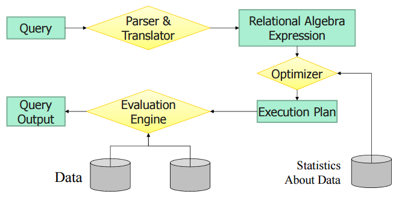
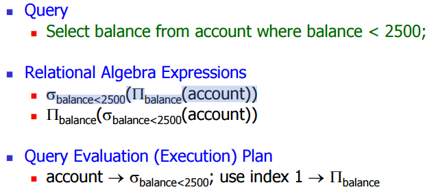
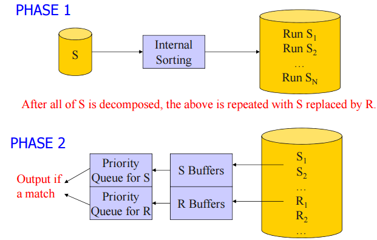
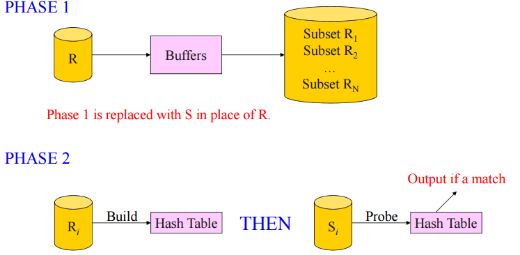

# 질의 처리
#데이터 베이스/질의 처리

---
## Steps in Query Processing

### Query Optimization
주어진 질의에 대한 최선의 실행 방법을 발견

데이터 모델에 따른 Query Optimization
- Network/Hierarchical Model
    - Application Programmer가 수행
- Relational Model
    - Automatic Optimization

### Catalog Information
- nr: # of records in r
- br: # of blocks containing records of r
- sr: size of a record of r in bytes
- fr: blocking factor of r (br = nr / fr)
- V(A,r)
    - #of distinct values that appear in r for attribute A
- SC(A,r)
    - selection cardinality of attribute A of r
    - SC(A,r) = nr = V(A,r)

### Information about Index
Statistics about Index i
- fi: the average fan-out of internal nodes of i
- HTi: the height of i
- LBi: # of bloks at the leaf level of i

## 질의 처리 비용의 계산
질의의 실행 비용을 결정하는 요인들
- 디스크 액세스 시간
- 질의를 실행하기 위한 CPU 시간
- 통신 시간

가정
- 디스크 액세스 시간이 가장 중요한 요인
- 각 디스크 블록을 액세스하는 시간은 동일

### Basic Alogorithms
- A1(linear search) - File scan
    - 모든 블록을 스캔하여 조건에 맞는 레코드를 검색
        - 검색 비용: br개의 블록 액세스
    - 조건이 키에 대한 검색일 경우, 비용 br/2
    - 순차검색의 장점
        - 검색 조건이나 레코드의 저장 순서, 혹은 인덱스의 유무에 관계없이 사용 가능

### Selection Using Index
- Index Scan 필요
- A2(primary indexx, equality on key)
    - EA2 = HTi+1
- A3(secondary index(clusterd), equality on non-key)
    - EA3 = HTi+ SC(A,r)/fr
- A4(secondary index(non-clusterd), equality on non-key)
    - EA4 = HTi + SC(A,r)

## Join Operation

### Nested-Loop Join
s, r relation 있을 때 하나하나씩 조인

### Block Nested-Loop Join
s, r relation 있을 때 블록단위로 조인

### Optimization
    - 메모리에 여러 개의 블록들이 저장될 경우
        - #of block access = B1+ (B1 / M) * B2
    
### Indexed Nested-Loop Join
- Join attribute에 대해 index 존재할 경우 적용 가능
- s, r relation, r 가르키는 index r.a가 있을 때 s와 r.a를 조인+ r 블록 개수

### Sort Merge Join

### Grace Hash Join

Sort-Merge Join vs Hash Join
- Sort-Merge Join
    - Cost = 3(br + bs)
    - Condition: br + bs < M^2(M: 메모리의 블록 수)
    - 장점: 조인 결과가 정렬
- Hash Join
    - Cost = 3(br + bs)
    - Condition: min(br, bs) < M^2(M: 메모리의 블록 수)
    - 장점: Sort-Merge Join보다 작은 메모리로 조인 가능
    - 병렬 처리에 적합