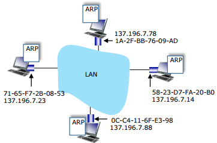
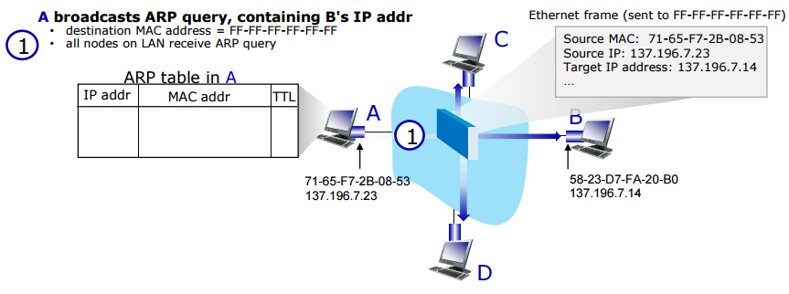
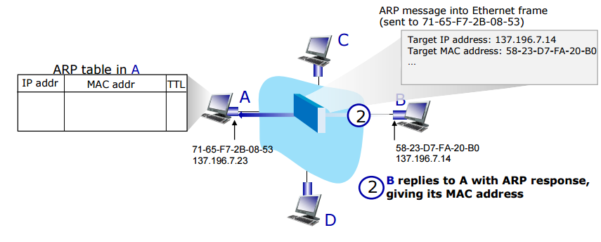

# ARP and Ethernet
#데이터 통신/ARP and Ethernet

---
## MAC(LAN or Physical or Ethernet) Addresses
- 48bit MAC address burned in NIC ROM
- MAC address allocation administered by IEEE
- Manufacturer buys portion of MAC address space(to assure uniqueness)

## ARP: Address Resolution Protocol
Question: how to determine interface's MAC address, knowing its IP address?

ARP table: each node on LAN has table
- IP/MAC address mappings for some LAN nodes: <IP address; MAC address; TTL>
- TTL(Time To Live): time after which address mapping will be forgotten(typically 20 min)

### ARP Protocol in Action
ex) A wants to send frame to B
- B's MAC address not in A's ARP table, so A uses ARP to find B's MAC address

