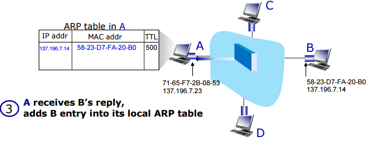
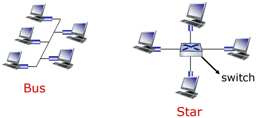
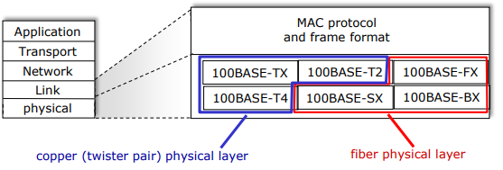

# ARP and Ethernet
#데이터 통신/ARP and Ethernet

---
## MAC(LAN or Physical or Ethernet) Addresses
- 48bit MAC address burned in NIC ROM
- MAC address allocation administered by IEEE
- Manufacturer buys portion of MAC address space(to assure uniqueness)

## ARP: Address Resolution Protocol
Question: how to determine interface's MAC address, knowing its IP address?

ARP table: each node on LAN has table
- IP/MAC address mappings for some LAN nodes: <IP address; MAC address; TTL>
- TTL(Time To Live): time after which address mapping will be forgotten(typically 20 min)

### ARP Protocol in Action
ex) A wants to send frame to B
- B's MAC address not in A's ARP table, so A uses ARP to find B's MAC address

## Ethernet
"dominant" wired LAN technology:
- First widely used LAN technology
- Single chip, multiple speeds

### Ethernet: Physical Topology
- Bus: popular through mid 90s
    - All nodes in same collision domain(can collide with each other)
- Switched (Star): prevails today
    - Active link-layer 2 switch in center
    - Each node runs a (seperate) Ethernet protocol (nodes do not collide with each other)

### Ethernet Frame Structure
- Sending interface encapsulates IP datagram in Ethernet frame

- Preamble:
    - 7bytes of 10101010 followed by one byte of 10101011
- Addresses: 6 byte source, destination MAC addresses
- Type: indicates higher layer protocol(IP)
- CRC: cyclic redundancy check at receiver
    - Error detected
- min: 64byte, max: 1500byte

### 802.3 Ethernet Standards: Link & Physical Layers
Many different Ethernet standards
- Common MAC protocol and frame format
- Different speeds
- Differnet physical layer media: fiber, cable

