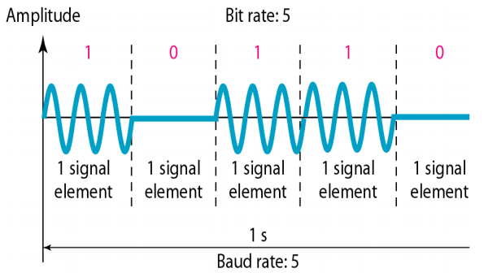
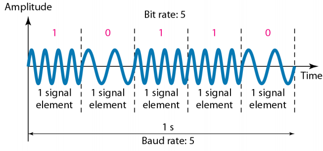
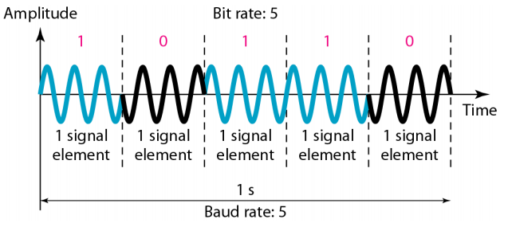
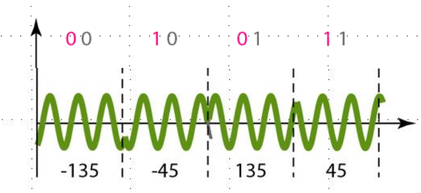
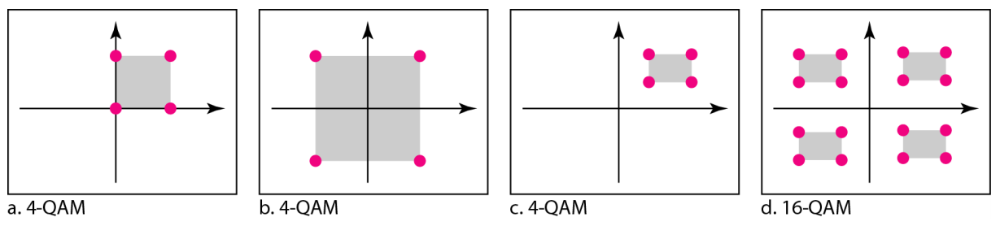

# Analog Transmission
#데이터통신/Analog Transmission

---
## Digital Data to Analog Signal
Main usage
- Wireless communications
    - Wi-Fi, Zigbee, LTE...

- Baud rate is the number of signal elements per second(bauds)
- In the analog transmission of digital data, the signal or baud rate is less than or equal to the bit rate

Baud = Bitrate/r (r = bit per second / signal per second)

## Digital Data to Analog Signal

### Amplitude Shift keying(ASK)
= (On-off keying, OOK)

### Frequency Shift Keying(FSK)

### Phase Shift Keying(PSK)
- PSK is much more robust than ASK from noise

### Quadrature PSK(QPSK)
- To increase the bit rate, we can code two or more bits onto one signal element

### Quadrature Amplitude Modulation (QAM)
- QAM is a combination of ASK and PSK
- Logical extension of QPSK

