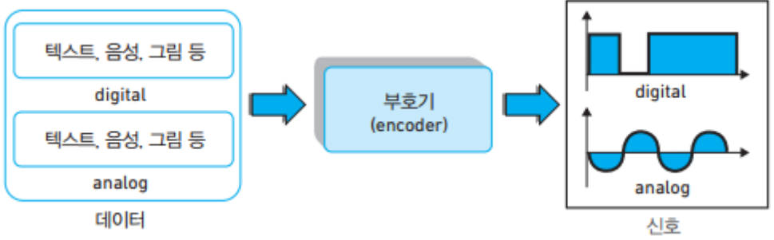
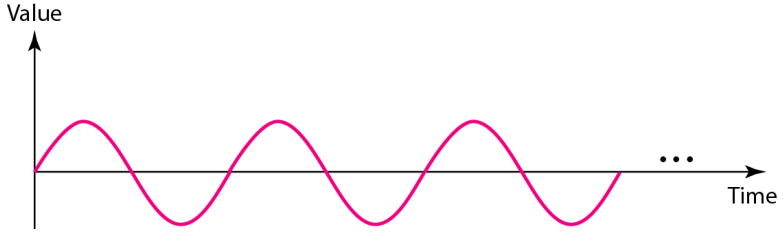
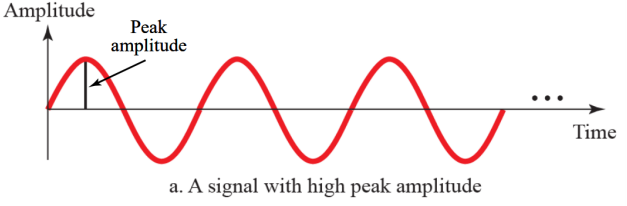
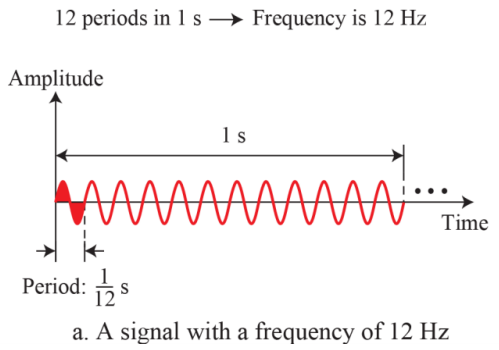
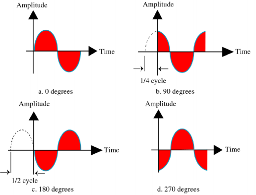
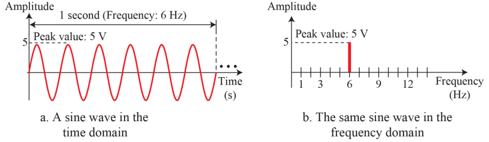
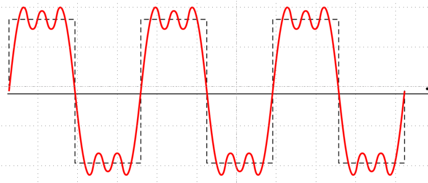
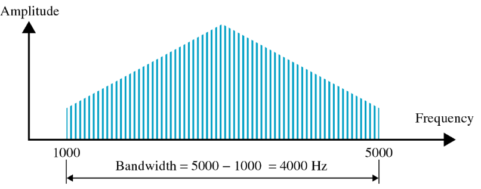
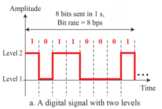
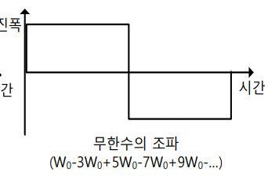

# Data and Signal
#데이터 통신/Data and Signal

---
## Analog and Digital Data
- Analog data are continuous and take continuous values ( ex) Voice )
- Digital data have discrete states and take discrete values ( ex) Files in our PC)

## Data and Signals
To be transmitted, data must be transformed to electromagnetic signals

- Data can be analog or digital
- Signals can be analog or digital

### Analog Signals
The most fundamental form of analog signal: sine wave

Sine wave described by the amplitude, frequency(or period), and phase

### Peak Amplitude, Frequency, and Phase
#### Peak amplitude of signal
- Absulute value of its highest intensity

#### Period: amount of time in sec, a signal needs to complete 1-cycle
#### Frequnecy: The number of periods in 1 sec

####  Phase: Describes the position of the waveform relative to time zero

## Time-domain and Frequnecy-domain
- Time-domain shows the relationship between the amplitude and the time
- Frequency-domain shows the relationship between the amplitude and the frequency

### Composite signal(복합신호)
A combination of simple sine waves with diffrent frequencies, amplitudes, and phases

### Frequency Spectrum and Bandwidth
Frequency spectrum
- The collection of all the component of frequencies

Bandwidth
- The width of the frequency spectrum

## Digital Signals
Information can also be represented by a digital signal

Bitrate
- of transmitted bits per second

Throughput
- of processed (received) bits per second

### Digital Signal As a Component Signal
여러개 합쳐져야 밑에꺼 나옴

