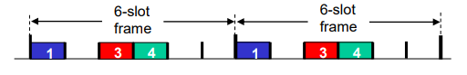

# Medium Access Control
#데이터통신/Medium Access Control

---
## Link Layer: Introduction
Terminology
- hosts and routers: nodes
- communication channels: links
    - wired & wireless
- layer-2 packet: frame, encapsulates datagram

## Multiple Access Links
Two types of "links":
- Point-to-point
    - point-to-point link between Ethernet switch, host
- Broadcast (shared wire or wireless medium)
    - Old-fashioned Ethernet
    - 802.11 wireless LAN, 4G/5G, satelite

## Medium Access Control(MAC) Protocol
If node receives two or more signals at the same time
- Collision

## MAC Protocols: Taxonomy
- Channel partitioning
    - divide channel into smaller "pieces"(time slots, frequency, code)
- Random access
    - channel not divided, allow collisions
    - "recover" from collisions
- "Taking turns"
    - nodes take turns, but nodes with more to send can take longer turns

### Channel Partitioning MAC Protocols: FDMA
FDMA: frequency division multiple access
- Channel spectrum divided into frequency bands

Example: 6-station LAN, 1, 3, 4 have packet to send, frequency bands 2,5,6 idle

### Channel Partitioning MAC Protocols: TDMA
TDMA: time division multiple access
- Access to channel in "rounds"

Example: 6-station LAN, 1,3,4 have packets to send, slots 2,5,6
idle

### Random Access Protocols
- Two or more transmiiting nodes: "collision"
- Random access MAC protocol specifies:
    - how to detect collisions
    - how to recover from collisions

CSMA(Carrier Sense Multiple Access)
- Simple CSMA: listen before transmit:
    - If channel sensed idle: transmit entire frame
    - If channel sensed busyL defer transmission

CSMA/CD: CSMA with collision detection
- Collisions detected within short time
- Colliding transmissions aborted, reducing channel wastage
- Collision detection easy in wired , difficult with wirelss
- After aborting, NIC enters binary(exponental) backoff:
    - After mth collision, NIC chooses K at random from {0,1,2, …, 2^m-1}. NIC waits K·512 bit times, returns to Step 2
    - More collisions: longer backoff interval

## Channel Partitioning VS Random Access
- Channel partitioning MAC protocols:
    - Share channell efficiently and fairly at high load
    - Inefficient at low load
- Random access MAC protocols
    - Efficient at low load
    - High load: collision overhead
- "Taking turns" protocols
    - look for best of both worlds

## "Taking turns MAC protocols
polling:
- Master node "invites" other nodes to transmit in turn
- Concerns:
    - polling overhead
    - latency
    - single point of failure (master)

Token passing:
- Control token passed from one node to next sequentially
- Concerns:
    - token overhead
    - latency
    - single point of failure (token)

