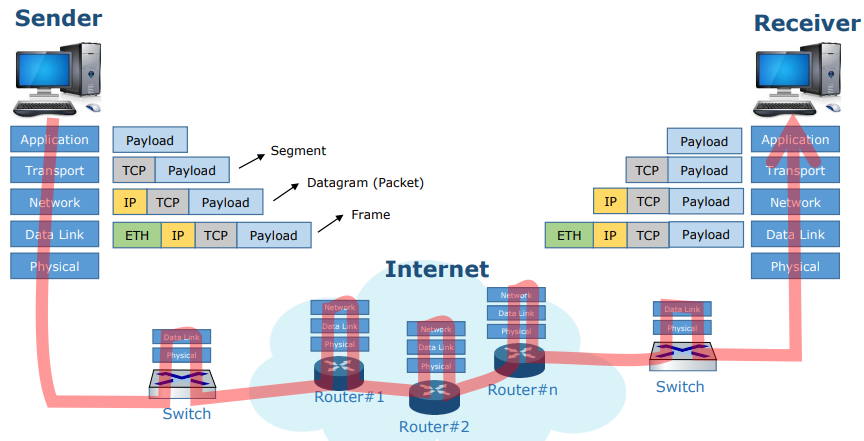

# Network Models
#데이터통신/Network Models

---
## Protocol
통신규약(foramt + order)

## TCP/IP Protocol Model

### Typcial Communication Path

Why Layering?
- Reduce Complexity
- Improve flexibility
- But
    - 최적화 된 성능은 아님
    - Cross-layer inforamtion often useful

## L1: Physical Link Layer
- The lowest level in the TCP/IP protocol suite
- Responsible for carring inidvidual bits
- Responsible for providing mechanical and electrical specifications
- encoding/decoding, modulation/demodulation

## L2: Data Link Layer
- Responsible for moving frames from one hop to the next 
- Consists of two sub-layer
    - Medium Access Control(MAC), Logical Link Control(LLC)
- Flow Control, error Control, access Control

## L3: Network Layer
- Responsible for the delivery of individual packets from the source host to the destination host
- Routing, IP Addressing

## L4: Transport Layer
- Responsible for the devliery of a message from one process to remote another process
- Reliable transmission, flow control, congestion control

## L5: Application Layer
- Responsible for providing services to the user
- HTTP, SMTP, FTP

