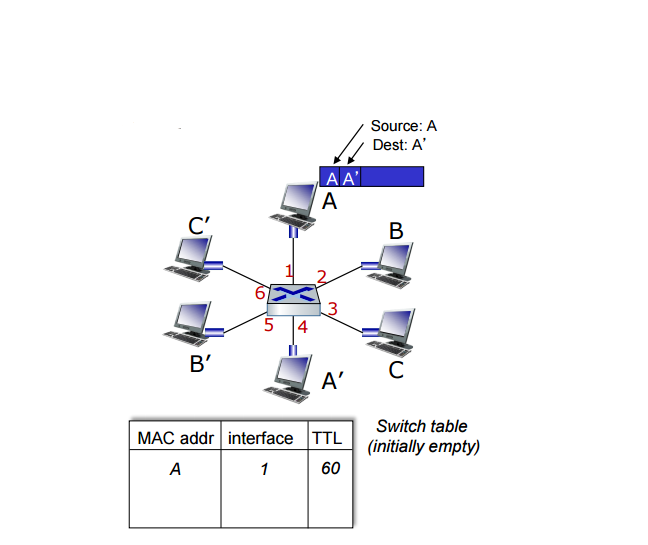

# Switch
#데이터통신/Switch

---
## Ethernet Switch
- Switch is a link-layer device
    - Store, forward Ethernet frames
    - Examine incoming frame's MAC address, selectively forward frame to one-or-more outgoing links
- Transparent: hosts unaware of presence of switches
- Self-learning
    - switches do not need to be configured

### Self-learning
Swich learns which hosts can be reahed through which interfaces
- When frame received, switch "learns" location of sender: incoming LAN segment
- Records sender/location pair in switch table

Self-learning, Forwarding
- Frame destination, A', location unknown:flood
- destination A location known: selectively send on just one link