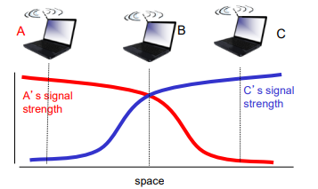

# Wireless LANs
#데이터 통신/Wireless LANs

---
### IEEE 802.11: Infrastructure Mode
Access point(AP) connects mobiles into wired network
- AP is L2 device

### IEEE 802.11: Ad-hoc Mode
- No APs
- Nodes can only transmit to other nodes within link coverage
- Nodes organize themselves into a network
- Example: Wi-Fi direct

### IEEE 802.11: Channels, Association
- Spectrum divided into channels at different frequencies
    - AP admin chooses frequency for AP
    - Interference possible
- Arriving host: must associate with an AP
    - Scans channels, listening for beacon frames containing AP's name(SSID) and MAC address(BSSID)
    - Selects AP to associate with

### IEEE 802.11: Channel Scanning
- Procedure for the mobile node to find APs that exists nearby
    - Passive scanning vs active scanning

### IEEE 802.11: Passive/Active Scanning

Passive scanning:
1) beacon frames sent from APs
2) association Request frame sent: H1 to selected AP
3) associaion Response frame sent from selected AP to H1

Active scanning
1) Probe Request frame broadcast from H1
2) Probe Respone frames sent from APs
3) association Request frame sent: H1 to selected AP
4) associaion Response frame sent from selected AP to H1

## Wireless Link Characteristics
Important differences from wired link...
- Decreased signal strength
- Interference from other sources
- Multipath propagationL: radio signal reflects off objects ground, arriving at destination at slightly different times

Multiple wireless senders, receivers create additional problems

## IEEE 802.11: Multiple Access
- Avoid collisions: 2+ nodes transmitting at same time
- 802.11: no collision detection
    - Difficult to sense collisions: high transmitting signal, weak received signal due to fading
    - Goal: avoid collisions: CSMA/CA

## IEEE 802.11 MAC Protocol: CSMA/CA
802.11 sender
1. if sense channel idle for DIFS then transmit entire frame
    - if no ACK, increase random backoff interval, and goes 2
2. if sense channel busy then
    - start random backoff timer
    - timer counts down while channel idle
    - transmit when timer expires

802.11 receiver
- if frame received OK return ACK after SIFS

## Avoiding Collsions
CSMA/CA cannot resolve "hidden terminal problem"
- Solution: CSMA/CA with RTS/CTS
- idea: sender "reserves" channel use for data frames using small reservation packets
    - Sender first transmits small request-to-send(RTS) frame to receiver using CSMA
    - Receiver broadcasts clear-to-send(CTS) frame in response to RTS
    - CTS heard by all nodes
        - Sender transmits data frame
        - Other stations defer transmissions

## SNR and BER
- SNR: signal-to-noise ratio
    - larger SNR - easier to extract signal from noise (a "good thing")
- BER: bit error rate
    - Smaller BER is better
- How to reduce BER
    - Increase power -> increase SNR -> decrease BER
    - Choose modulation scheme that is more robust to noise

-> Sender dynamically adapts modulation scheme or TX power

## 802.11 Frame Format

## 802.11 Frame: Addressing

## What is Handoff?
Handoff
- Process that a station moves from one AP to another AP

## Handoff Procedure
Handoff
- Scanning
- Authentication
- Reassociation

Scanning methods
- Active scan
    - By exchanging probe request/probe reqsponse frames
- Passive scan
    - Passively listens to periodically broadcasted beacon frames

## PSM in WLAN
IEEE 802.11 Power Saving Mode (PSM)
- Wake up and listen to a beacon frame at beacon listening interval
    - Traffic Indication MAP (TIM) field is used for indicating buffered packets
    
- Retrieve buffered packetrs by sending a PS-Poll frame to the AP
    - AP delivers a buffered packet when a PS-Poll frame is received
    - More data field within delivered frame is set to indicate remaining buffered frames
- Keep sleeping until next beacon listening interval
    - Low power consumption
    - High transmission delay

