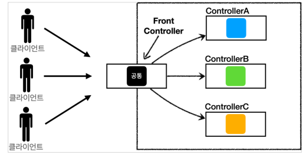
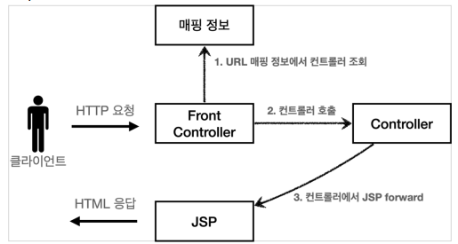
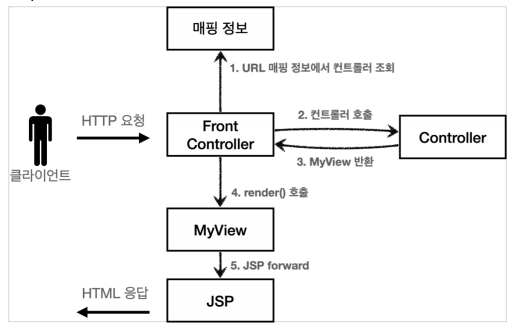
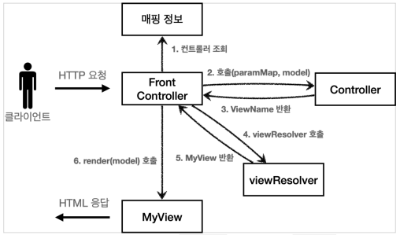
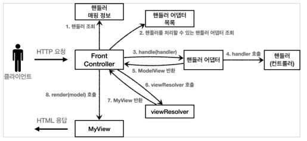

# MVC 프레임워크 만들기
#TIL/스프링 MVC1/

---
## 프론트 컨트롤러 패턴

FrontController 패턴 특징
- 프론트 컨트롤러 서블릿 하나로 클라이언트 요청을 받음
- 프론트 컨트롤러가 요청에 맞는 컨트롤러를 찾아서 호출
- 공통 처리 가능

스트링 웹 MVC의 핵심도 바로 FrontController

스프링 웹 MVC의 DispatcherServlet이 FrontController 패턴으로 구현되어 있음

## 프론트 컨트롤러 도입 - v1
프론트 컨트롤러를 단계적으로 도입

## View 분리 - v2
뷰로 이동하는 부분에 중복 -> 별도로 뷰를 처리하는 객체 만들자

## Model 추가 - v3
서블릿 종속성 제거(컨트롤러에서 HttpServletRequest, HttpServletResponse 제거) -> 별도의 Model 객체 반환

뷰 이름 중복 제거
-WEB-INF/views/new-form.jsp -> new-form
-WEB-INF/views/save-result.jsp -> save-result

## 단순하고 실용적인 컨트롤러 - v4
v3을 조금 변경해서 개발자들이 매우 편리하게 개발할 수 있는 v4

## 유연한 컨트롤러 - v5

### 어댑터 패턴
지금까지 프론트 컨트롤러는 한가지 방식의 컨트롤러 인터페이스만 사용.

어댑터 패턴을 사용해서 다양한 방식의 컨트롤러를 처리

- 핸들러 어댑터: 다양한 종류의 컨트롤러를 호출하게 해줌
- 핸들러: 컨트롤러의 이름을 더 넓은 범위인 핸들러로 변경

---
참고
https://www.inflearn.com/course/%EC%8A%A4%ED%94%84%EB%A7%81-mvc-1#