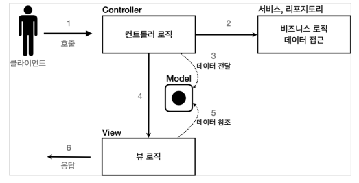

# 서블릿, JSP, MVC 패턴
TIL/스프링 MVC1/

---
## 서블릿과 JSP의 한계

서블릿으로 개발할 때는 뷰(View)화면을 위한 HTML을 만드는 작업이 자바 코드에 섞여서 지저분하고 복잡
JSP를 사용한 덕분에 뷰를 생성하는 HTML 작업을 깔ㄲ끔하게 가져가고, 중간중간 동적으로 변경이 필요한 부분에만 자바 코드를 적용했지만 여전히 비즈니스로직, 뷰 영역이 같이 있다.

## MVC 패턴의 등장

### Model View Controller

컨트롤러: HTTP 요청을 받앗 파라미터를 검증하고, 비즈니스 로직을 실행. 그리고 뷰에 전달할 결과 데이터를 조회해서 모델에 담는다.

모델: 뷰에 출력할 데이터를 담아둔다.

뷰: 모델에 담겨있는 데이터를 사용해서 화면을 그림



### MVC 패턴 - 한계
중복이 많고, 필요하지 않는 코드들도 많음

### 포워드 중복
View로 이동하는 코드 항상 중복 호출

```java
RequestDispatcher dispatcher = request.getRequestDispatcher(viewPath);
dispatcher.forward(request, response);
```

### ViewPath에 중복

```java
String viewPath = "/WEB-INF/views/new-form.jsp";
```

- prefix: /WEB-INF/views/
- suffix: .jsp

그리고 만약 jsp가 아닌 다른 뷰 템플릿으로 변경한다면 전체 코드 다 변경해야 됨

### 사용하지 않는 코드
사용할 때도 있고, 사용하지 않을 때도 있음.

```java
HttpServletRequest request, HttpServletResponse response
```

### 공통 처리가 어렵다


---
참고
https://www.inflearn.com/course/%EC%8A%A4%ED%94%84%EB%A7%81-mvc-1#