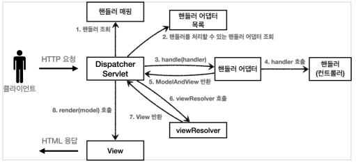

# 스프링 MVC - 구조 이해
#TIL/스프링 MVC1/

---

## SpringMvc 구조

동작 순서
1. 핸들러 조회: 핸들러 매핑을 통해 요청 URL에 매핑된 핸들러(컨트롤러)를 조회한다.
2. 핸들러 어댑터 조회: 핸들러를 실행할 수 있는 핸들러 어댑터를 조회한다.
3. 핸들러 어댑터 실행: 핸들러 어댑터를 실행한다.
4. 핸들러 실행: 핸들러 어댑터가 실제 핸들러를 실행한다.
5. ModelAndView 반환: 핸들러 어댑터는 핸들러가 반환하는 정보를 ModelAndView로 변환해서 반환한다.
6. viewResolver 호출: 뷰 리졸버를 찾고 실행
7. View 반환: 뷰 리졸버는 뷰의 논리 이름을 물리 이름으로 바꾸고, 렌더링 역활을 담당하는 뷰 객체를 반환
8. 뷰 렌더링: 뷰를 통해서 뷰를 렌더링

### 스프링 부트가 자동 등록하는 핸들러 매핑과 핸들러 어댑터
(우선순위)

#### HandlerMapping
0 = RequestMappingHandlerMapping : 애노테이션 기반의 컨트롤러인 @RequestMapping에서 사용

1 = BeanNameUrlHandlerMapping : 스프링 빈의 이름으로 핸들러를 찾는다.

#### HandlerAdapter
0 = RequestMappingHandlerAdapter : 애노테이션 기반의 컨트롤러인 @RequestMapping에서사용

1 = HttpRequestHandlerAdapter : HttpRequestHandler 처리

2 = SimpleControllerHandlerAdapter : Controller 인터페이스(애노테이션X, 과거에 사용) 처리

#### @RequestMapping
지금 스프링에서 주로 사용하는 애노테이션 기반의 컨트롤러를 지원하는 매핑과 어댑터. 실무에서 99.9% 이 방식의 컨트롤러 사용

### 스프링 부트가 자동 등록하는 뷰 리졸버
1 = BeanNameViewResolver : 빈 이름으로 뷰를 찾아서 반환한다. (예: 엑셀 파일 생성기능에 사용)

2 = InternalResourceViewResolver : JSP를 처리할 수 있는 뷰를 반환한다.

---
참고
https://www.inflearn.com/course/%EC%8A%A4%ED%94%84%EB%A7%81-mvc-1#