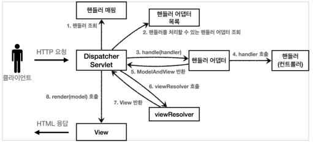
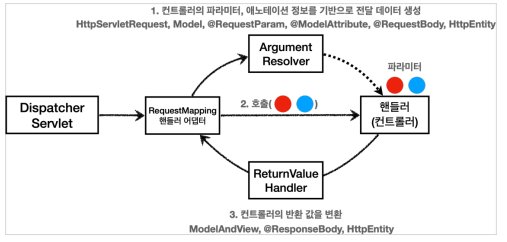
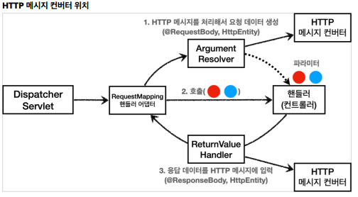

# 스프링 MVC
#TIL/스프링 MVC1/

---
## 스프링 MVC - 구조 이해

###  SpringMvc 구조



동작 순서
1. 핸들러 조회: 핸들러 매핑을 통해 요청 URL에 매핑된 핸들러(컨트롤러)를 조회한다.
2. 핸들러 어댑터 조회: 핸들러를 실행할 수 있는 핸들러 어댑터를 조회한다.
3. 핸들러 어댑터 실행: 핸들러 어댑터를 실행한다.
4. 핸들러 실행: 핸들러 어댑터가 실제 핸들러를 실행한다.
5. ModelAndView 반환: 핸들러 어댑터는 핸들러가 반환하는 정보를 ModelAndView로 변환해서 반환한다.
6. viewResolver 호출: 뷰 리졸버를 찾고 실행
7. View 반환: 뷰 리졸버는 뷰의 논리 이름을 물리 이름으로 바꾸고, 렌더링 역활을 담당하는 뷰 객체를 반환
8. 뷰 렌더링: 뷰를 통해서 뷰를 렌더링


### 스프링 부트가 자동 등록하는 핸들러 매핑과 핸들러 어댑터
(우선순위)

#### HandlerMapping
0 = RequestMappingHandlerMapping : 애노테이션 기반의 컨트롤러인 @RequestMapping에서 사용

1 = BeanNameUrlHandlerMapping : 스프링 빈의 이름으로 핸들러를 찾는다.

#### HandlerAdapter
0 = RequestMappingHandlerAdapter : 애노테이션 기반의 컨트롤러인 @RequestMapping에서사용

1 = HttpRequestHandlerAdapter : HttpRequestHandler 처리

2 = SimpleControllerHandlerAdapter : Controller 인터페이스(애노테이션X, 과거에 사용) 처리

#### @RequestMapping
지금 스프링에서 주로 사용하는 애노테이션 기반의 컨트롤러를 지원하는 매핑과 어댑터. 실무에서 99.9% 이 방식의 컨트롤러 사용

### 스프링 부트가 자동 등록하는 뷰 리졸버
1 = BeanNameViewResolver : 빈 이름으로 뷰를 찾아서 반환한다. (예: 엑셀 파일 생성기능에 사용)

2 = InternalResourceViewResolver : JSP를 처리할 수 있는 뷰를 반환한다.

---
## 스프링 MVC - 기본 기능

### 로깅
SLF4J 로그 라이브러리
- SLF4J 인터페이스, 그 구현체로 주로 Logbakck 사용

#### 로그 레벨
- LEVEL:  TRACE > DEBUG > INFO > WARN > ERROR

#### 로그 사용시 장점
- 쓰레드 정보, 클래스 이름 같은 부가 정보를 함께 볼 수 있다.
- 로그 레벨에 따라 개발 서버에서는 모든 로그를 출력하고, 운영서버에서는 출력하지 않는 등 로그를 상황에 맞게 조절 가능
- 성능도 System.out 보다 좋음

### 요청 매핑

- @RestController
    - @Controller는 반환 값이 String이면 뷰 이름으로 인식
    - @RestController는 HTTP 메시지 바디에 바로 입력

- @RequestMapping("/hello-basic")
    - /hello-basic URL 호출이 오면 이 메서드가 실행되도록 매핑

#### PathVariable(경로 변수) 사용
```java
@GetMapping("/mapping/{userId}")
public String mappingPath(@PathVariable("userId") String data) {
    //
}
```
- @PathVariable의 이름과 파라미터 이름이 같으면 생략 가능

### HTTP 요청 - 기본, 헤더 조회
애노테이션 기반의 스프링 컨트롤러는 다양한 파라미터를 지원, 이번에는 HTTP 헤더 정보 조회

- HttpServletRequest
- HttpServletResponse
- HttpMethod: HTTP 메서드를 조회
- Locale: Locale 정보를 조회한다.
- @RequestHeader MultiValueMap<String, String> headerMap
    - 모든 HTTP 헤더를 MultiValueMap 형식으로 조회
- @RequestHeader(" ") String ~
    - 특정 HTTP 헤더를 조회
- @CookieValue(~ ) String cookie
    - 특정 쿠키를 조회

### HTTP 요청 파라미터 - @RequestParam
@RequestParam: 파라미터 이름으로 바인딩

@RequestParam의 name(value) 속성이 파라미터 이름으로 사용
- @RequestParam("username") String memberName
- ->request.getParameter("username")

HTTP 파라미터 이름이 변수 이름과 같으면 @RequestParam 생략 가능

#### 파라미터 필수 여부 -requestParamRequired
@RequestParam(required = true)
- 파라미터 필수 여부
- 기본값이 필수(true)

### HTTP 요청 파라미터 - @ModelAttribute
@ModelAttribute HelloData helloData
- HelloData 객체를 생성한다.
- 요청 파라미터의 이름으로 HelloData 객체의 프로퍼티 찾고 setter 호출해서 파라미터 값 입력

@ModelAttribute 생략 가능

생략
- String, int, Integer 같은 단순 타입 = @RequestParam
- 나머지 = @ModelAttribute (argument resolver 로 지정해둔 타입 외)

### HTTP 요청 메시지 - 단순 텍스트
@RequestBody String ~

HTTP 메시지 바디 정보를 편리하게 조회, 헤더 정보가 필요하면 @RequestHeader or HttpEntity 사용

### HTTP 요청 메시지 - JSON
@RequestBody 객체 파라미터
- @RequestBody HelloData data
- @RequestBody에 직접 만든 객체 지정할 수 있다

HttpEntity , @RequestBody를 사용하면 HTTP 메시지 컨버터가 HTTP 메시지 바디의 내용을 우리가 원하는 문자나 객체 등으로 변환

@RequestBody는 생략 불가능

@RequestBody 요청
- JSON 요청 -> HTTP 메시지 컨버터 -> 객체

@ResponseBody 응답
- 객체 -> HTTP 메시지 컨버터 -> JSON 응답

### HTTP 응답 - HTTP API, 메시지 바디에 직접 입력

@ResponseBody
- 뷰 리졸버를 실행하지 않고, HTTP 메시지 바디에 직접 입력

@RestController

해당 컨트롤러에 모두 @ResponseBody 적용(Rest API(HTTP API)를 만들 때 사용하는 컨트롤러)

### HTTP 메시지 컨버터
스프링 MVC는 다음의 경우에 HTTP 메시지 컨버터를 적용
- HTTP 요청: @RequestBody, HttpEntity(RequestEntity)
- HTTP 응답: @ResponseBody, HttpEntity(ResponseEntity)

#### 스프링 부트 기본 메시지 컨버터
(우선순위)

0 = ByteArrayHttpMessageConverter

1 = StringHttpMessageConverter 

2 = MappingJackson2HttpMessageConverter

#### HTTP 요청 데이터 읽기
- HTTP 요청이 오고, 컨트롤러에서 @RequestBody, HttpEntity 파라미터를 사용
- 메시지 컨버터가 메시지를 읽을 수 있는지 확인하기 위해 canRead() 호출
    - 대상 클래스 타입 지원하는가.
        - ex) (btye[], String, HelloData)
    - HTTP 요청의 Content-Type 미디어 타입을 지원하는가
        - ex) text/plain, application/json
- canRead() 조건을 만족하면 read()를 호출해서 객체를 생성하고 반환

#### HTTP 응답 데이터 생성
- 컨트롤러에서 @ResponseBody, HttpEntity로 값이 반환
- 메시지 컨버터가 메시지를 쓸 수 있는지 확인하기 위해 canWrite()를 호출
    - 대상 클래스 타입 지원하는가
    - HTTP 요청의 Accept 미디어 타입을 지원하는가
- canWrite() 조건을 만족하면 write()를 호출해서 HTTP 응답 메시지 바디에 데이터를 생성

### 요청 매핑 핸들러 어댑터  구조



동작방식

ArgumentResolver의 supportsParameter()를 호출해서 해당 파라미터를 지원하는지 체크하고, 지원하면  resloveArgument()를 호출해서 실제 객체 생성후 컨트롤러로 넘어감

#### ReturnValueHandler
HandlerMethodReturnValueHandler를 줄여서 ReturnValueHandler라 하고 ArgumentResolver와 비슷한데, 이것은 응답 값을 변환하고 처리한다.



---
참고
https://www.inflearn.com/course/%EC%8A%A4%ED%94%84%EB%A7%81-mvc-1#