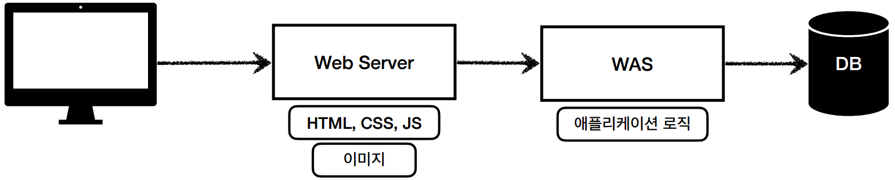
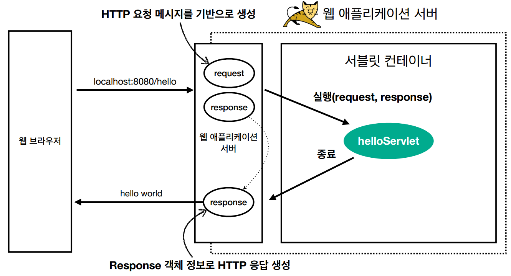
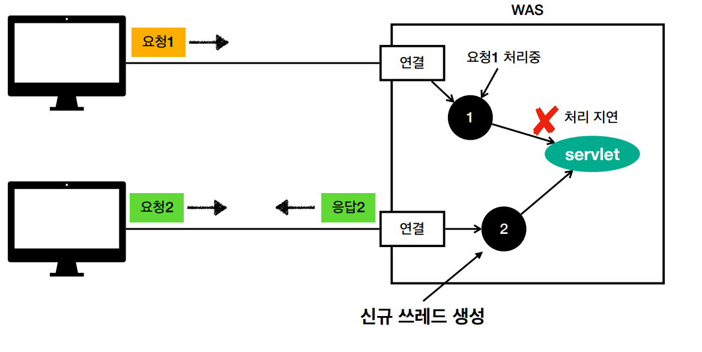
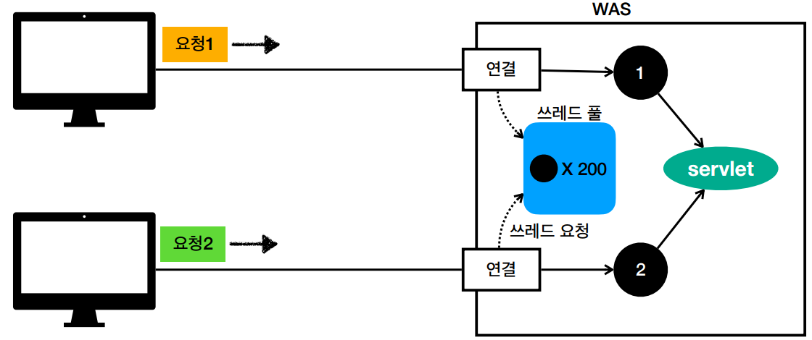
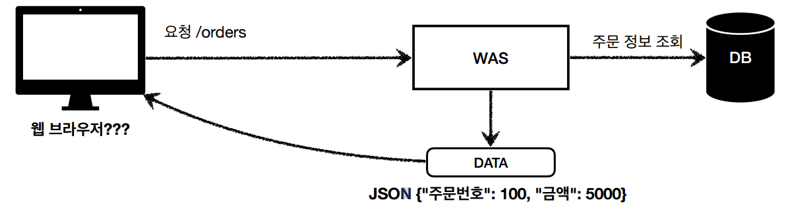
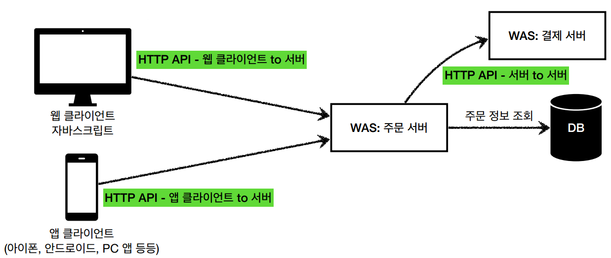

# 웹 애플리케이션 이해
#TIL/스프링 MVC1/

---
## 웹 서버(Web Server)
- Http 기반으로 동작
- 정적 리소스 제공
- ex) NGIX, APACHE

## 웹 애플리케이션 서버(WAS - Web Application Server)
- HTTP 기반으로 동작
- 웹 서버 기능 포함 +
- 프로그램 코드를 실행해서 애플리케이션 로직 수행
    - 동적 HTML, HTTP API(JSON)
    - 서블릿, JSP, 스프링 MVC
- ex) 톰캣(Tomcat), Jetty, Undertow

## 웹 시스템 구성 -WEB, WAS, DB



## 서블릿

```java
@WebServlet(name = "helloServlet", urlPatterns = "/hello")
public class HelloServlet extends HttpServlet {

    @Override
    protected void service(HttpServletRequest request, HttpServletResponse response) { 
     //애플리케이션 로직
    }
}
```

- urlPatterns(/hello)의 URL이 호출되면 서블릿 코드가 실행
- HTTP 요청 정보를 편리하게 사용할 수 있는 HttpServletRequest
- HTTP 응답 정보를 편리하게 제공할 수 있는 httpServletResponse



### 서블릿 컨테이너
- 톰캣처럼 서블릿 지원하는 WAS를 서블릿 컨테이너
- 서블릿 컨테이너는 서블릿 객체를 생성, 초기화, 호출, 종료하는 생명주기 관리
- 서블릿 객체는 싱글톤으로 관리
    - 공유 변수 사용 주의
- 동시 요청을 위한 멀티 쓰레드 처리 지원

## 동시 요청 - 멀티 쓰레드

### 쓰레드
애플리케이션 코드를 하나하나 순차적으로 실행하는 것은 쓰레드

### 요청 마다 쓰레드 생성



- 장점
    - 동시 요청을 처리할 수 있다.
    - 리소스(CPU, 메모리)가 허용할 때 까지 처리가능
- 단점
    - 쓰레드 생성 비용은 매우 비싸다
        - 고객의 요청이 올 때 마다 쓰레드가 발생하면, 응답속도가 늦어진다.
    - 쓰레드는 컨텍스트 스위칭 비용이 발생한다.
    - 쓰레드는 생성에 제한이 없다
        - 고객 요청이 많이 오면, CPU, 메모리 임계점을 넘어서 서버가 죽을 수 있다.

### 쓰레드 풀
요청 마다 쓰레드 생성의 단점 보완



- 특징
    - 필요한 쓰레드를 쓰레드 풀에 보관하고 관리
    - 쓰레드 풀에 생성 가능한 쓰레드의 최대치를 관리
- 사용
    - 쓰레드가 필요하면, 이미 생성되어 있는 쓰레드를 쓰레드 풀에서 꺼내서 사용한다.
    - 사용을 종료하면 쓰레드 풀에 해당 쓰레드를 반납
    - 최대 쓰레드가 모두 사용중?
        - 기다리는 요청은 거절하거나 특정 숫자만큼 대기 가능
- 장점
    - 미리 쓰레드가 생성되어 있으므로, 쓰레드를 생성하고 종료하는 비용(CPU)이 절약되고, 응답 시간 빠름
    - 생성 가능한 쓰레드의 최대치가 있으므로 안전하게 처리가능


## HTTP API
- HTML이 아니라 데이터를 전달
- 주로 JSON 형식 사용
- 다양한 시스템에서 호출



- 데이터만 주고 받음, UI 화면이 필요하면, 클라이언트가 별도 처리
- 앱, 웹 클라이언트, 서버 to 서버



## 서버사이드 렌더링, 클라이언트 사이드 렌더링
- SSR - 서버 사이드 렌더링
    - HTML 최종 결과를 서버에서 만들어서 웹 브라우저에 전달
    - 주로 정적인 화면에 사용
    - 관련기술: JSP, 타임리프 -> 백엔드 개발자

- CSR - 클라이언트 사이드 렌더링
    - HTML 결과를 자바스크립트를 사용해 웹 브라우저에서 동적으로 생성해서 적용
    - 주로 동적인 화면에 사용. 웹 환경을 마치 앱 처럼 필요한 부분부분 변경할 수 있음
    - 관련기술: React, Vue.js -> 웹 프론트엔드 개발자


---
참고
https://www.inflearn.com/course/%EC%8A%A4%ED%94%84%EB%A7%81-mvc-1#