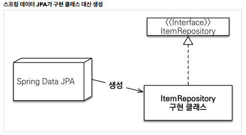

# 스프링 데이터 JPA
#TIL/스프링 데이터 JPA/

---
## 공통 인터페이스 기능

### JavaConfig 설정 - 스프링 부트 사용시 생략 가능

```java
@Configuration
@EnableJpaRepositories(basePackages = "jpabook.jpashop.repository")
public class AppConfig {}
```
- 스프링 부트 사용시 @SpringBootApplication 위치를 지정
- 만약 위치가 달라지면 @EnableJpaRepositories 필요



### 공통 인터페이스 적용
순수 JPA로 구현한 Repository 대신 스프링 데이터 JPA가 제공하는 공통 인터페이스 사용
```java
public interface MemberRepository extends JpaRepository<T, ID> {
}   //T: 엔티티타입, ID: 식별자 타입(PK)
```

---
## 쿼리 메소드 기능

### 메소드 이름으로 쿼리 생성
```java
List<Member> findByUsernameAndAgeGreaterThan(String username, int age);
```
- 스프링 데이터 JPA는 메소드 이름을 분석해서 JPQL을 생성하고 실행

### @Query, 리포지토리 메소드에 쿼리 정의
```java
@Query("select m from Member m where m.username = :username and m.age = :age")
List<Member> findUser(@param("username") String username, @param("age") int age)
```

### Query, 값, DTO조회하기
단순히 값 하나를 조회
```java
@Query("select m.username from Member m")
List<String> findUsernameList();
```

DTO로 직접 조회
```java
@Query("select new study.datajpa.dto.MemberDto(m.id, m.username, t.name)" + "from Member m join m.team t)"
List<MemberDto> findMemberdto();
```

### 파라미터 바인딩
```java
select m from Member m where m.username = ?0 //위치 기반
select m from Member m where m.username = :name //이름 기반
```

코드 가독성과 유지보수를 위해 이름 기반 파라미터 바인딩 쓰자

#### 컬렉션 파라미터 바인딩
Collection 타입으로 in절 지원
```java
@Query("select m from Member m where m.username in :names")
List<Member> findByNames(@Param("names") List<String> names);
```

### 스프링 데이터 JPA 페이징과 정렬

#### 페이징과 정렬 파라미터
- org.springframework.data.domain.Sort: 정렬기능
- org.springframework.data.domain.pageable: 페이징 기능 (내부에 Sort 포함)

#### 특별한 반환 타입
- org.springframework.data.domain.Page: 추가 count 쿼리 결과를 포함하는 페이징
- org.springframework.data.domain.Slice: 추가 count 쿼리 없이 다음 페이지만 확인 가능(내부적으로 limit + 1조회)
- List: 추가 count 쿼리 없이 결과만 반환

카운트 쿼리 분리(복잡한 sql에서 사용, 데이터는 left join, 카운트는 left join 안해도 됨)
```java
@Query(value = "select m from Member m ",
        countQuery = "select count(m.username) from Member m")
Page<Member> findMemberAllCountBy(Pageable pageable);
```

#### 페이지를 유지하면서 엔티티를 DTO로 변환
```java
Page<Member> page = meberRepostiory.findByAge(10, pageRequest);
Page<MemberDto> dtoPage = page.map(m -> new MemberDto());
````


---
참고
https://www.inflearn.com/course/%EC%8A%A4%ED%94%84%EB%A7%81-%EB%8D%B0%EC%9D%B4%ED%84%B0-JPA-%EC%8B%A4%EC%A0%84#