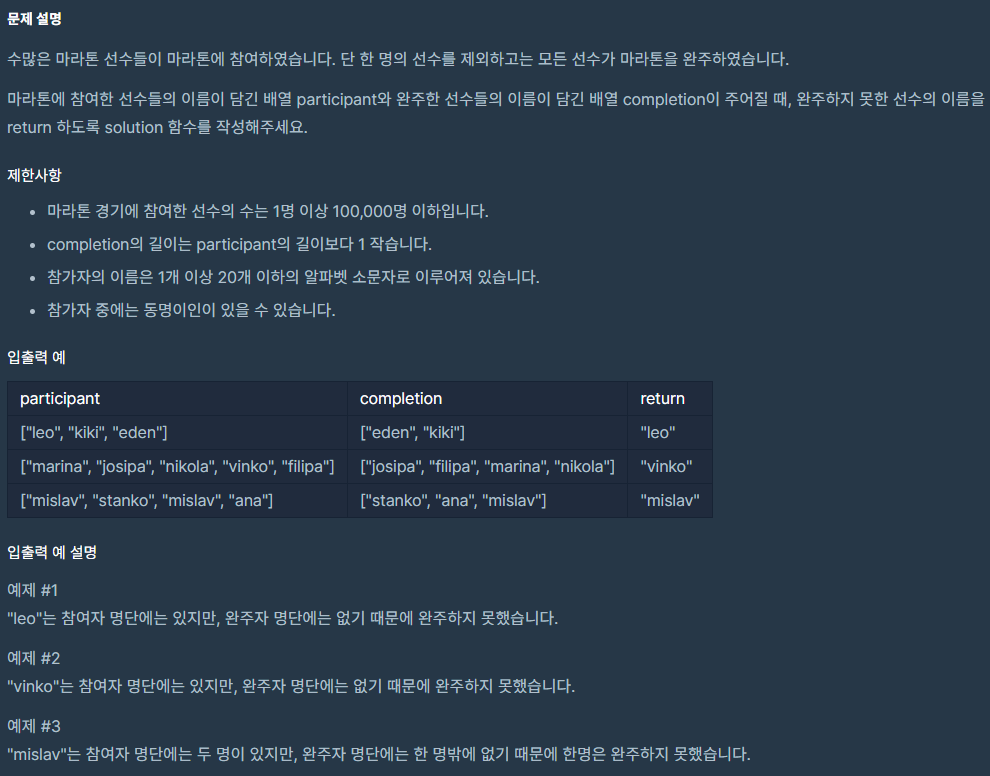
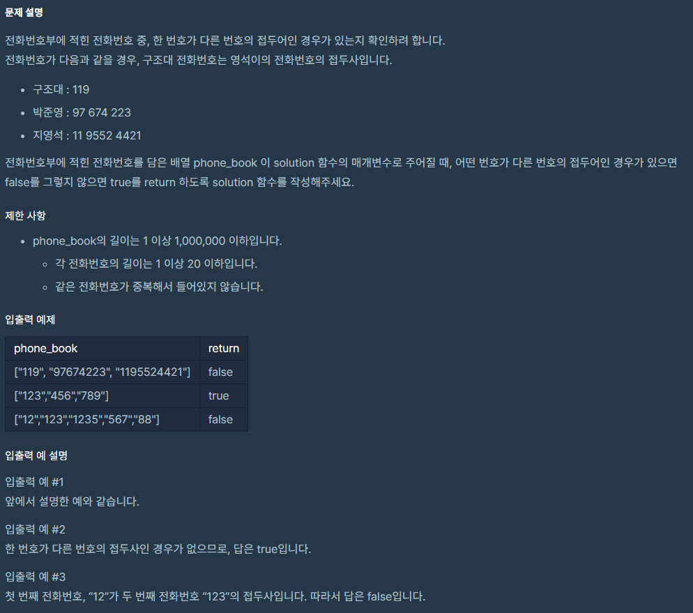
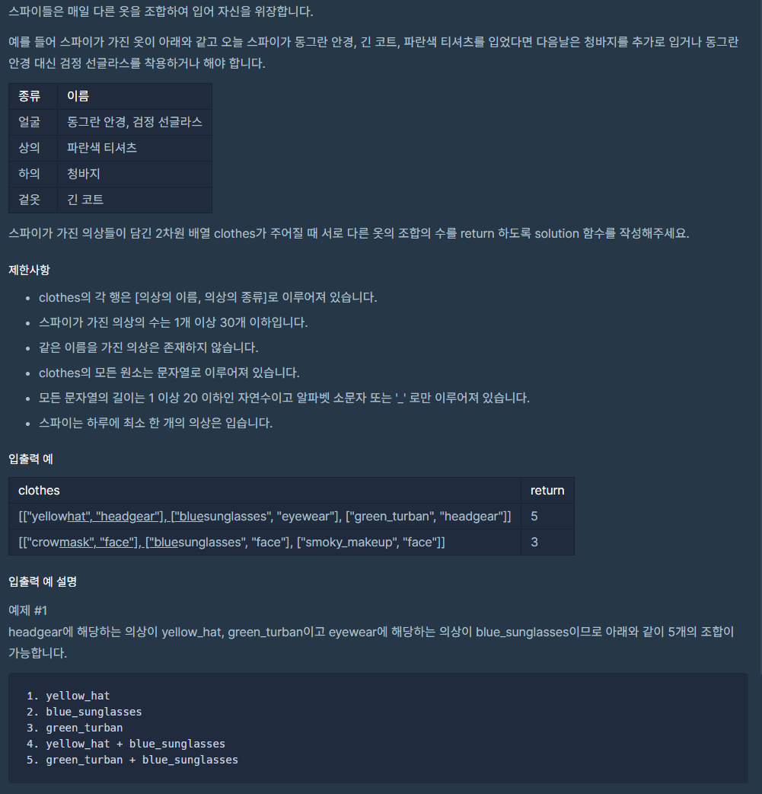

# PS(21.10.25)
## 알고리즘/PS(21.10.25)

---



```java
import java.util.HashMap;

class Solution {
    public String solution(String[] participant, String[] completion) {

        HashMap<String, Integer> player = new HashMap<>();
        String answer = "";

        for (String par : participant)
            player.put(par, player.getOrDefault(par, 0) + 1);

        for(String com : completion)
            player.put(com, player.get(com)-1);

        for (String key : player.keySet()) {
            if (player.get(key) != 0) {
                answer = key;
                break;
            }
        }

        return answer;
    }
}
```



```java
import java.util.HashSet;

class Solution {
    public boolean solution(String[] phone_book) {
        boolean answer = true;

        HashSet<String> set = new HashSet<>();
        for(String phone : phone_book)
            set.add(phone);

        for (int i = 0; i < phone_book.length; i++) {
            for (int j = 1; j < phone_book[i].length(); j++) {
                if (set.contains(phone_book[i].substring(0, j))) {
                    answer = false;
                    return answer;
                }
            }
        }

        return answer;
    }
}
```



```java
import java.util.HashMap;

class Solution {
    public int solution(String[][] clothes) {
        int answer = 1;
        HashMap<String, Integer> spy = new HashMap<>();

        for (int i = 0; i < clothes.length; i++) {
            String key = clothes[i][1];
            spy.put(key, spy.getOrDefault(key, 0)+1);
        }

        for (Integer val : spy.values()) {
            answer *= val+1;
        }

        return answer-1;
    }
}
```

https://programmers.co.kr/learn/courses/30/lessons/42577

```java
import java.util.HashMap;

class Solution {
    public boolean solution(String[] phone_book) {

        HashMap<String, Integer> map = new HashMap<>();

        for (int i = 0; i < phone_book.length; i++) {
            map.put(phone_book[i], i);
        }

        for (int i = 0; i < phone_book.length; i++) {
            for (int j = 0; j < phone_book[i].length(); j++) {
                if (map.containsKey(phone_book[i].substring(0, j))) {
                    return false;
                }
            }
        }
        return true;
    }
}
```

https://programmers.co.kr/learn/courses/30/lessons/42578

```java
import java.util.HashMap;

class Solution {
    public int solution(String[][] clothes) {
        HashMap<String, Integer> map = new HashMap<>();
        int answer = 1;

        for (int i = 0; i < clothes.length; i++) {
            map.put(clothes[i][1], map.getOrDefault(clothes[i][1], 0)+1);
        }

        for (String s : map.keySet()) {
            answer *= (map.get(s)+1);
        }

        return answer-1;
    }
}
```