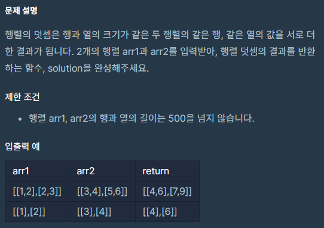
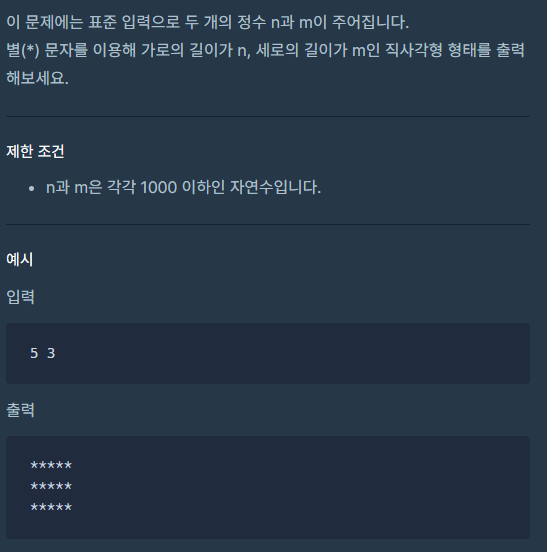
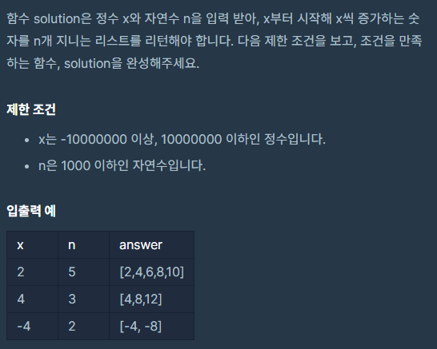
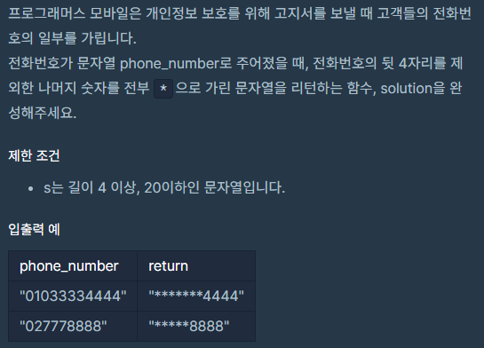
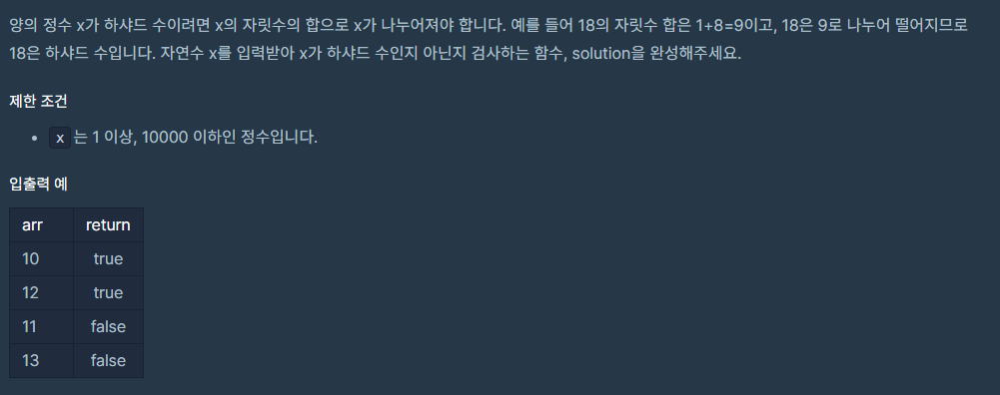

# PS(21.10.26)
## 알고리즘/PS(21.10.26)

---



```java
class Solution {
    public int[][] solution(int[][] arr1, int[][] arr2) {
        int[][] arr = new int[arr1.length][arr1[0].length];
        int row = arr1.length;
        int col = arr1[0].length;

        for (int i = 0; i < row; i++) {
            for (int j = 0; j < col; j++) {
                arr[i][j] += arr2[i][j];
            }
        }

        return arr;
    }
}
```



```java
import java.util.Scanner;

class Solution {
    public static void main(String[] args) {
        Scanner sc = new Scanner(System.in);
        int a = sc.nextInt();
        int b = sc.nextInt();

        for (int i = 0; i < b; i++) {
            for (int j = 0; j < a; j++) {
                System.out.print("*");
            }
            System.out.println();
        }
    }
}
```



```java
class Solution {
    public long[] solution(int x, int n) {
        long[] answer = new long[n];

        answer[0] = x;
        for (int i = 1; i < answer.length; i++) {
            answer[i] = answer[i-1] + x;
        }

        return answer;
    }
}
```



```java
class Solution {
    public String solution(String phone_number) {
        String answer = "";
        int len = phone_number.length();
        String num = phone_number.substring(len-4);

        for(int i =0; i< len-4; i++)
            answer += "*";

        return answer+num;
    }
}
```



```java
//1
class Solution {
    public boolean solution(int x) {
        String s = Integer.toString(x);
        boolean answer = false;
        int temp = x;
        int sum = 0;
        for (int i = s.length(); i > 0; i--) {
            int f = x / (int) Math.pow(10, i - 1);
            sum += f;
            x -= f * (int) Math.pow(10, i - 1);
        }

        if(temp % sum == 0)
            answer = true;

        return answer;
    }
}

//2
class Solution {
    public boolean solution(int x) {
        boolean answer = false;
        String[] split = String.valueOf(x).split("");

        int sum = 0;
        for(String num : split)
            sum += Integer.parseInt(num);

        if(x % sum == 0)
            answer = true;

        return answer;
    }
}
```