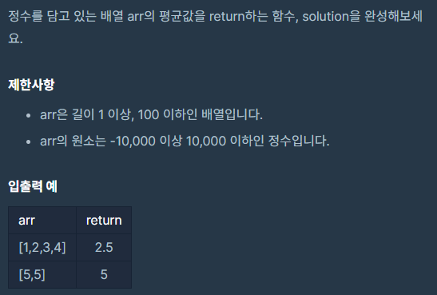
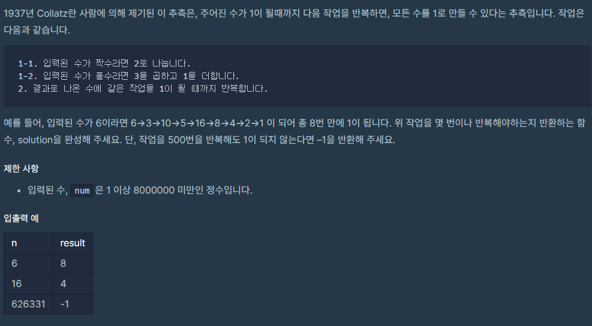
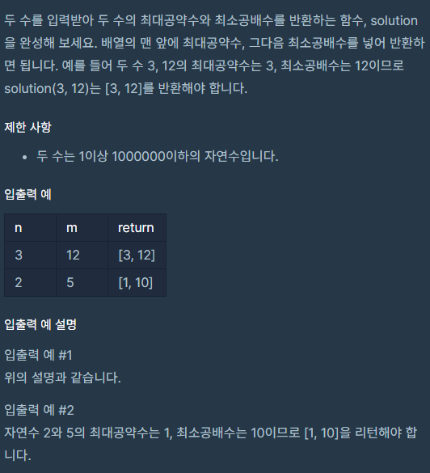
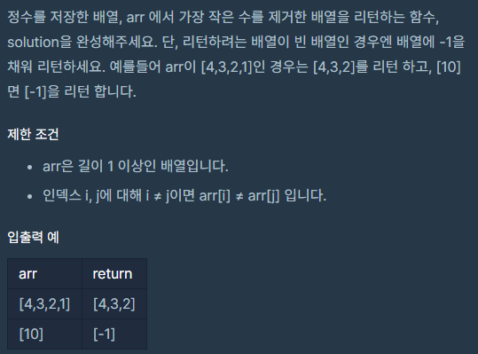
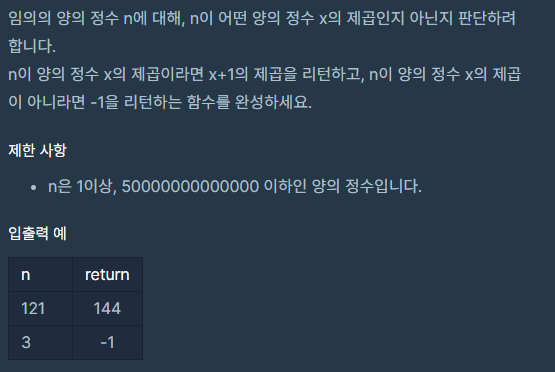
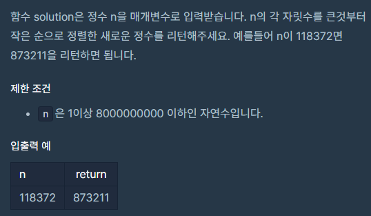
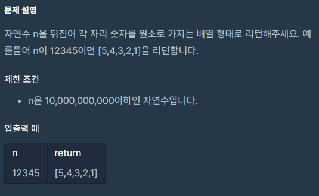
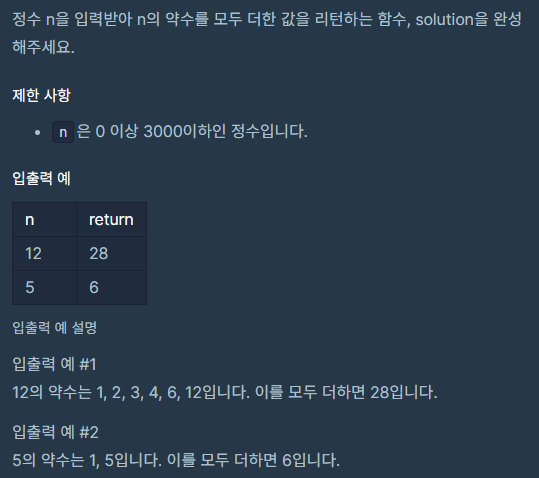

# PS(21.10.27)
#알고리즘/PS(21.10.27)

---



```java
class Solution {
    public double solution(int[] arr) {
        double sum = 0;
        for(int i = 0; i < arr.length; i++)
            sum += arr[i];

        double answer = sum / arr.length;
        return answer;
    }
}
```



```java
class Solution {
    public static int solution(long num) {
        int i;
        for (i = 0; i < 500; i++) {
            if(num == 1)
                break;
            System.out.println(num);
            if( num % 2 == 0)
                num /= 2;
            else
                num = num*3 +1;
        }

        if(num != 1)
            return -1;
        else
            return i;
    }

    public static void main(String[] args) {
        int ans = solution(626331);
        System.out.println(ans);
    }
}
```



```java
//1
class Solution {
    public static int[] solution(int n, int m) {
        int[] answer = new int[2];
        int min = Math.min(n, m);
        boolean flag = false;
        for (int i = min; i >= 1; i--) {
            if (n % i == 0 && m % i == 0) {
                answer[0] = i;
                break;
            }
        }

        int mul = m;
        int ind;
        for (int i = 1; m * i <= n * m; i++) {
            mul = m * i;
            ind = 1;
            while (n * ind <= mul) {
                if (n * ind == mul) {
                    answer[1] = n * ind;
                    flag = true;
                    break;
                }
                ind++;
            }
            if(flag == true)
                break;
        }

        return answer;
    }

    public static void main(String[] args) {
        int[] solution = solution(3, 12);
        System.out.println(solution[0]);
        System.out.println(solution[1]);
    }
}

//2
import java.util.Arrays;

class Solution {
    public static int[] solution(int n, int m) {
        int[] answer = new int[2];

        answer[0] = gcd(n, m);
        answer[1] = (n * m) / answer[0];
        return answer;
    }

    public static int gcd(int p, int q) {
        if( q == 0)
            return p;
        return gcd(q, p%q);
    }

    public static void main(String[] args) {
        int[] solution = solution(3, 7);
        System.out.println(Arrays.toString(solution));
    }
}
```



```java
class Solution {
    public int[] solution(int[] arr) {
        if(arr.length == 1)
            return new int[]{-1};

        int i, j, index = 0;
        int[] answer = new int[arr.length-1];

        for (i = 1; i < arr.length; i++) {
            if (arr[index] > arr[i]) {
                index = i ;
            }
        }

        for (i = 0, j = 0; j < answer.length; i++, j++) {
            if(i == index)
                i++;
            answer[j] = arr[i];
        }

        return answer;
    }
}
```



```java
class Solution {
    public long solution(long n) {
        long sqrt = (long) Math.sqrt(n);
        if( n ==(long) Math.pow(sqrt, 2))
            return (long)Math.pow(sqrt+1, 2);
        else
            return -1;
    }
}
```



```java
class Solution {
    public static long solution(long n) {
        String[] split = String.valueOf(n).split("");
        String temp = "";
        String answer = "";

        for (int i =0; i < split.length-1; i++) {
            for (int j = i + 1; j < split.length; j++) {
                if (Integer.parseInt(split[i]) < Integer.parseInt(split[j])) {
                    temp = split[i];
                    split[i] = split[j];
                    split[j] = temp;
                }
            }
        }

        for(String num : split)
            answer += num;

        return Long.parseLong(answer);
    }

    public static void main(String[] args) {
        long solution = solution(118372);
        System.out.println(solution);
    }
}
```



```java
import java.util.Arrays;

class Solution {
    public static int[] solution(long n) {
        String[] split = String.valueOf(n).split("");
        int[] answer = new int[split.length];

        for(int i = split.length-1, j =0; i >= 0; i--, j++)
            answer[j] = Integer.parseInt(split[i]);

        return answer;
    }

    public static void main(String[] args) {
        int[] solution = solution(12345);
        System.out.println(Arrays.toString(solution));
    }
}
```


```java
import java.util.*;

public class Solution {
    public int solution(int n) {
        int answer = 0;
        String[] split = String.valueOf(n).split("");

        for(String num : split)
            answer += Integer.parseInt(num);

        return answer;
    }
}
```

```java
//1
class Solution {
    public static String solution(String s) {
        int flen = s.length();
        String[] split = s.split(" ");
        String answer = "";
        for (String word : split) {
            for (int i = 0; i < word.length(); i++) {
                String[] wsplit = word.split("");
                if(i % 2 ==0)
                    answer += wsplit[i].toUpperCase();
                else
                    answer += wsplit[i].toLowerCase();
            }
            answer += " ";
        }
        System.out.println(answer);
        int len = answer.length();

        if (flen != len - 1) {
            for(int i =0; i < flen - (len -1) ; i++)
                answer += " ";
        }

        return answer.substring(0, answer.length()-1);
    }

    public static void main(String[] args) {
        String try_hello_world = solution("Hello eVeryone  ");
        System.out.println(try_hello_world);
    }
}

//2
class Solution {
    public static String solution(String s) {
        String answer = "";
        int cnt = 0;
        String[] split = s.split("");

        for(String ss : split) {
            cnt = ss.contains(" ") ? 0 : cnt +1;
            answer += cnt % 2 == 0 ? ss.toLowerCase() : ss.toUpperCase();
        }
        return answer;
    }

    public static void main(String[] args) {
        String try_hello_world = solution("Hello eVeryone  ");
        System.out.println(try_hello_world);
    }
}
```



```java
class Solution {
    public int solution(int n) {
        int answer = 0;
        for (int i = 1; i <= n; i++) {
            if (n % i == 0) {
                answer += i;
            }
        }

        return answer;
    }
}
```