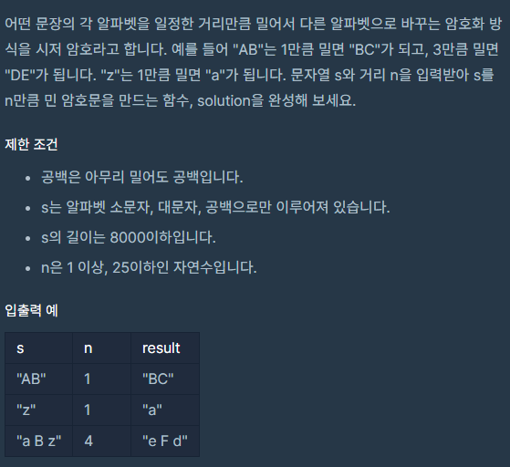
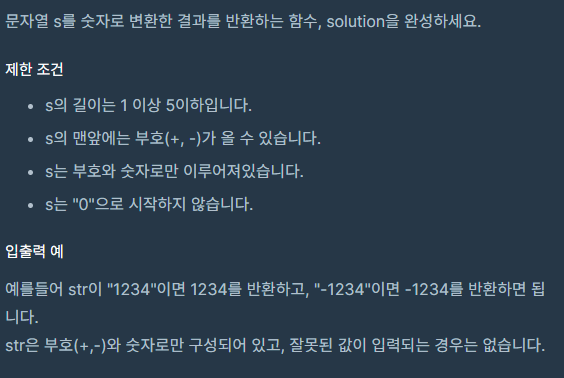
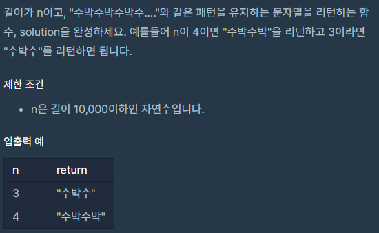
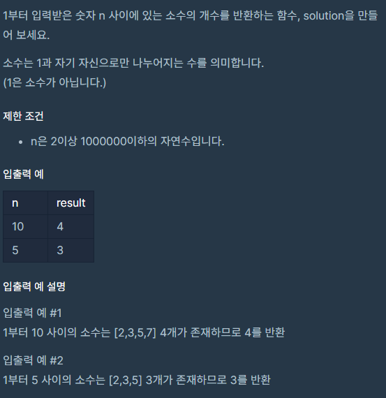

# PS(21.10.28)
#알고리즘/PS(21.10.28)

---



```java
class Solution {
    public static String solution(String s, int n) {
        String answer = "";
        String[] split = s.split("");

        for (String ss : split) {
            System.out.println(ss);
            if (ss.equals(" ")) {
                answer += ' ';
            } else {
                if('a' > ss.charAt(0) && ss.charAt(0) + n > 'Z')
                    answer += (char)('A' + n - ('Z' - ss.charAt(0) + 1));
                else if(ss.charAt(0) + n > 'z')
                    answer += (char)('a' + n - ('z' - ss.charAt(0) + 1));
                else
                    answer += (char)(ss.charAt(0) + n);
            }
        }

        return answer;
    }

    public static void main(String[] args) {
        String solution = solution("AB", 1);
        System.out.println(solution);
    }
}
```



```java
//1
class Solution {
    public int solution(String s) {
        int answer = Integer.parseInt(s);
        return answer;
    }
}

//2
class Solution {
    public static int solution(String s) {
        boolean sign = true;
        int result = 0;
        char ch;

        for (int i = 0; i < s.length(); i++) {
            ch = s.charAt(i);
            if (ch == '-') {
                sign = false;
            } else if (ch != '+') {
                result = result * 10 + (ch - '0');
            }
        }

        return sign ? result : -1 * result;
    }

    public static void main(String[] args) {
        int solution = solution("-1234");
        System.out.println(solution);
    }
}
```



```java
class Solution {
    public static String solution(int n) {
        String answer = "";
        for (int i = 0; i < n; i++) {
            if (i % 2 == 0) {
                answer += "수";
            } else {
                answer += "박";
            }
        }

        return answer;
    }

    public static void main(String[] args) {
        String solution = solution(3);
        System.out.println(solution);
    }
}
```



```java
class Solution {
    public static int solution(int n) {
        int answer = 0;
        int[] arr = new int[n+1];

        for(int i= 2; i <= n; i++)
            arr[i] = 1;

        for (int i = 2; i * i <= n; i++) {
            if(arr[i] == 0)
                continue;

            for(int j = i + i; j <= n; j += i)
                arr[j] = 0;
        }

        for (int i = 2; i <= n; i++) {
            if(arr[i] == 1)
                answer++;
        }

        return answer;
    }

    public static void main(String[] args) {
        int solution = solution(10);
        System.out.println(solution);
    }
}
```