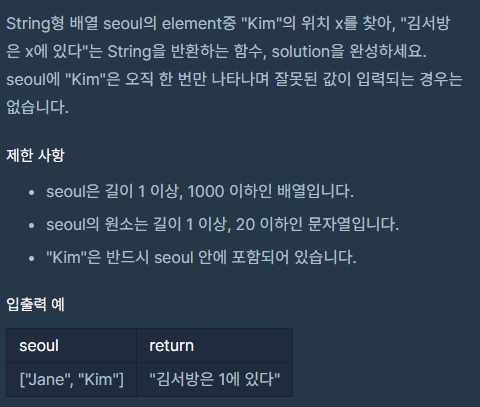
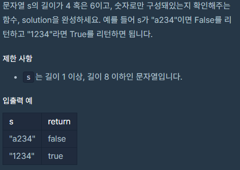
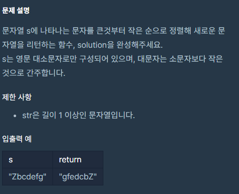
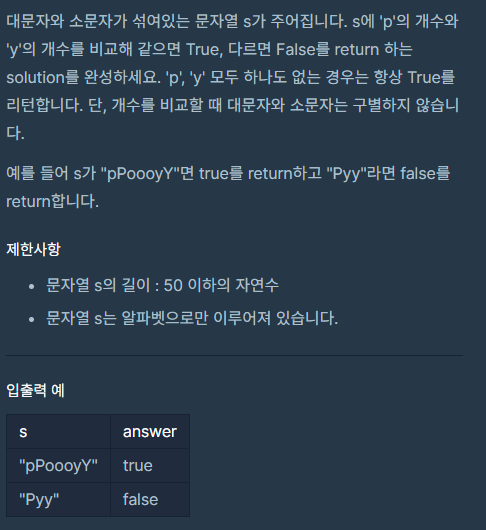
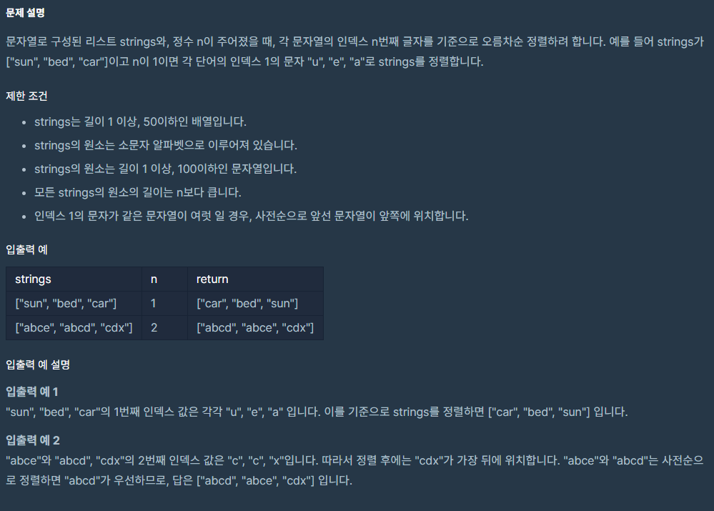
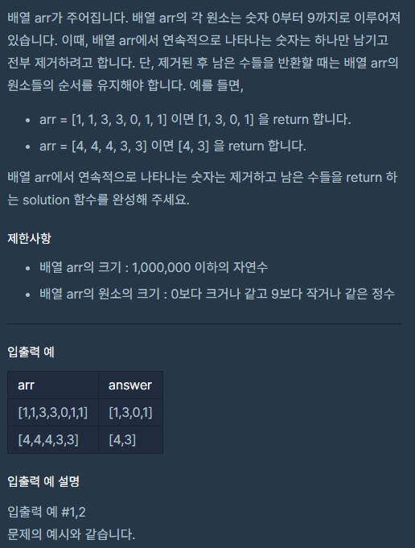
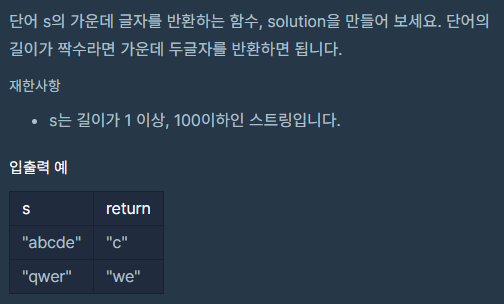
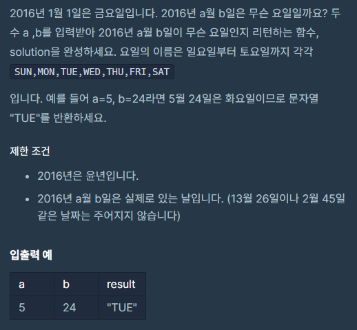

# PS(21.10.29)
#알고리즘/PS(21.10.29)

---



```java
class Solution {
    public String solution(String[] seoul) {
        int cnt = 0;
        for (String s : seoul) {
            if (s.equals("Kim")) {
                break;
            }
            cnt++;
        }

        String answer = "김서방은 " +cnt+"에 있다";
        return answer;
    }
}
```



```java
class Solution {
    public static boolean solution(String s) {
        if (s.length() != 4 && s.length() != 6)
            return false;

        String[] split = s.split("");
        for (String ss : split) {
            if( '0' <= ss.charAt(0) && ss.charAt(0) <= '9')
                continue;
            else
                return false;
        }

        return true;
    }

    public static void main(String[] args) {
        boolean solution = solution("123456");
        System.out.println(solution);
    }
}
```



```java
//1
class Solution {
    public String solution(String s) {
        String answer = "";
        String temp = "";
        String[] split = s.split("");
        for (int i = 0; i < s.length()-1; i++) {
            for (int j = i + 1; j < s.length(); j++) {
                if (split[i].charAt(0) < split[j].charAt(0)) {
                    temp = split[i];
                    split[i] = split[j];
                    split[j] = temp;
                }
            }
        }

        for(String ss :split)
            answer += ss;
        return answer;
    }
}

//2
import java.util.Arrays;

class Solution {
    public String solution(String s) {
        char[] chars = s.toCharArray();
        Arrays.sort(chars);
        return new StringBuilder(new String(chars)).reverse().toString();
    }
}
```



```java
class Solution {
    boolean solution(String s) {
        String[] split = s.split("");
        boolean answer;
        int pcnt = 0;
        int ycnt = 0;
        for (int i = 0; i < s.length(); i++) {
            if (split[i].equals("p") || split[i].equals("P")) {
                pcnt++;
            } else if (split[i].equals("y") || split[i].equals("Y")) {
                ycnt++;
            }
        }

        if (pcnt == ycnt) {
            answer = true;
        }else
            answer = false;

        return answer;
    }
}
```



```java
import java.util.Arrays;

class Solution {
    public static String[] solution(String[] strings, int n) {
        String temp;
        for (int i = 0; i < strings.length-1; i++) {
            for (int j = i + 1; j < strings.length; j++) {
                char ch1 = strings[i].charAt(n);
                char ch2 = strings[j].charAt(n);
                if (ch1 > ch2) {
                    temp = strings[i];
                    strings[i] = strings[j];
                    strings[j] = temp;
                } else if (ch1 == ch2) {
                    int min = Math.min(strings[i].length(), strings[j].length());
                    for (int k = 0; k < min; k++) {
                        if(strings[i].compareTo(strings[j]) < 0)
                            break;
                        else if (strings[i].compareTo(strings[j]) > 0) {
                            temp = strings[i];
                            strings[i] = strings[j];
                            strings[j] = temp;
                            break;
                        }
                    }
                }
            }

        }

        return strings;
    }

    public static void main(String[] args) {
        String[] solution = solution(new String[]{"decsax", "aesdsbx", "befcxcz", "ceqrxdq"}, 0);
        System.out.println(Arrays.toString(solution));
    }
}
```


```java
class Solution {
    public long solution(int a, int b) {
        int min = Math.min(a,b);
        int max = Math.max(a,b);
        long answer = 0;
        for (int i = min; i <= max; i++) {
            answer += i;
        }

        return answer;
    }
}
```



```java
import java.util.*;

public class Solution {
    public int[] solution(int []arr) {
        int[] answer = {};
        int len = 0;

        int con = -1;
        for (int i = 0; i < arr.length; i++) {
            if (con == arr[i]) {
                arr[i] = -1;
                continue;
            }
            con = arr[i];
            len++;
        }

        int j=0;
        answer = new int[len];
        for (int i = 0; i < arr.length; i++) {
            if(arr[i] != -1)
                answer[j++] = arr[i];
        }

        return answer;
    }
}
```



```java
class Solution {
    public String solution(String s) {
        String answer = "";
        int len = s.length();
        if (len % 2 != 0) {
            answer += s.substring(len/2, len/2+1);
        } else {
            answer += s.substring(len/2 -1, len/2 + 1);
        }

        return answer;
    }
}
```



```java
class Solution {
    public String solution(int a, int b) {
        String answer = "";
        int sum = 0;
        int[] month = new int[]{30, 29, 31, 30, 31, 30, 31, 31, 30, 31, 30, 31};
        String [] day = new String[]{"FRI", "SAT", "SUN", "MON", "TUE", "WED", "THU"};
        if (a == 1) {
            return day[(b - 1) % 7];
        } else {
            for(int i =0; i < a-1; i++)
                sum += month[i];
            return day[(sum + b) % 7];
        }
    }
}
```

https://www.acmicpc.net/problem/10804

```java
import java.util.Arrays;
import java.util.Scanner;

class Main {
    public static void main(String[] args) {
        int []card = new int[]{1,2,3,4,5,6,7,8,9,10,11,12,13,14,15,16,17,18,19,20};
        int []store = new int[20];
        Scanner sc = new Scanner(System.in);
        int a,b;
        for (int i = 0; i < 10; i++) {
            a = sc.nextInt();
            b = sc.nextInt();

            for (int j = a - 1; j < b; j++) {
                store[j] = card[j];
            }

            for (int j = b - 1, k = a-1; j >= a - 1; j--, k++) {
                card[j] = store[k];
            }
        }

        for (int val : card) {
            System.out.print(val + " ");
        }
    }
}
```

https://www.acmicpc.net/problem/2979

```java
import java.util.Scanner;

class Main {
    public static void main(String[] args) {
        int a,b,c;
        int s,e;
        int[] arr = new int[101];
        int result = 0;
        Scanner sc = new Scanner(System.in);
        a = sc.nextInt();
        b = sc.nextInt();
        c = sc.nextInt();
        for (int i = 0; i < 3; i++) {
            s = sc.nextInt();
            e = sc.nextInt();
            for (int j = s; j < e; j++) {
                arr[j] += 1;
            }
        }

        for (int i = 1; i <= 100; i++) {
            if(arr[i] == 1)
                result += a * 1;
            else if(arr[i] == 2)
                result += b * 2;
            else if(arr[i] ==3)
                result += c * 3;
        }

        System.out.print(result);
    }
}
```

https://www.acmicpc.net/problem/10813

```java
import java.util.Scanner;

class Main {
    public static void main(String[] args) {
        int[] bas;
        int n,m, i, j, temp;
        Scanner sc = new Scanner(System.in);
        n = sc.nextInt();
        m = sc.nextInt();
        bas = new int[n+1];
        for(int k = 1; k < bas.length; k++)
            bas[k] = k;

        for (int k = 0; k < m; k++) {
            i = sc.nextInt();
            j = sc.nextInt();

            temp = bas[i];
            bas[i] = bas[j];
            bas[j] = temp;
        }

        for(int k = 1; k < bas.length; k++)
            System.out.print(bas[k] + " ");
    }
}
```

https://www.acmicpc.net/problem/1966

```java
import java.util.LinkedList;
import java.util.List;
import java.util.Queue;
import java.util.Scanner;

class Main {
    public static void main(String[] args) {
        int t, n, m, im;
        int cnt;
        boolean flag;
        int[] tr;
        List<Integer> list = new LinkedList<>();
        Scanner sc = new Scanner(System.in);
        t = sc.nextInt();
        for (int i = 0; i < t; i++) {
            flag = true;
            cnt =0;
            list.clear();
            n = sc.nextInt();
            m = sc.nextInt();
            tr = new int[n];
            tr[m] = 1;
            for (int j = 0; j < n; j++) {
                im = sc.nextInt();
                list.add(im);
            }

            while (flag) {
                Integer print = list.get(0);
                for (int j = 0; j < list.size(); j++) {
                    if (print < list.get(j)) {
                        if (tr[0] == 1) {
                            tr[0] = 0;
                            tr[list.size() - 1] = 1;
                            m = list.size() - 1;
                        } else {
                            tr[m - 1] = 1;
                            tr[m--] = 0;
                        }
                        list.remove(0);
                        list.add(print);
                        break;
                    }

                    if (j == list.size() - 1) {
                        if (tr[0] == 1) {
                            cnt++;
                            flag = false;
                            break;
                        } else {
                            cnt++;
                            list.remove(0);
                            tr[m] = 0;
                            m--;
                            tr[m] = 1;
                        }
                    }
                }
            }
            System.out.println(cnt);
        }

    }
}
```

https://programmers.co.kr/learn/courses/30/lessons/12953

```java
class Solution {
    public static int solution(int[] arr) {
        int answer = 0;
        long max = 1;
        for (int i = 0; i < arr.length; i++) {
            max *= arr[i];
        }

        for (int i = 1; i <= max; i++) {
            for (int j = 0; j < arr.length; j++) {
                if(i % arr[j] !=0)
                    break;

                if (j == arr.length - 1) {
                    answer = i;
                    return answer;
                }
            }
        }

        return answer;
    }

    public static void main(String[] args) {
        int solution = solution(new int[]{3, 4, 9, 16});
        System.out.println(solution);
    }
}
```