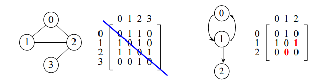
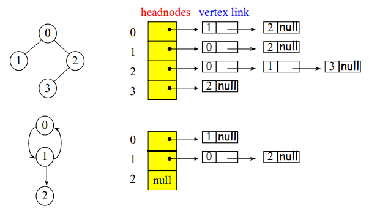
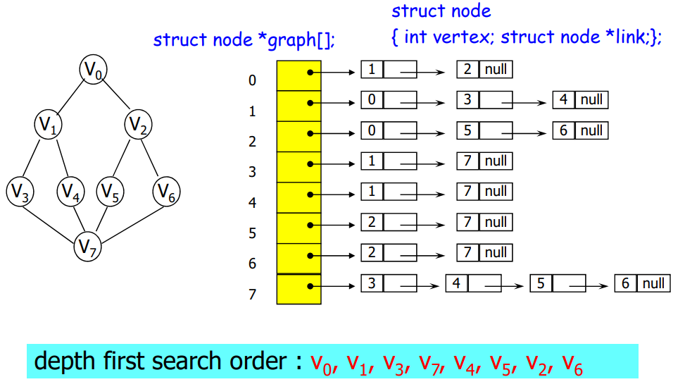
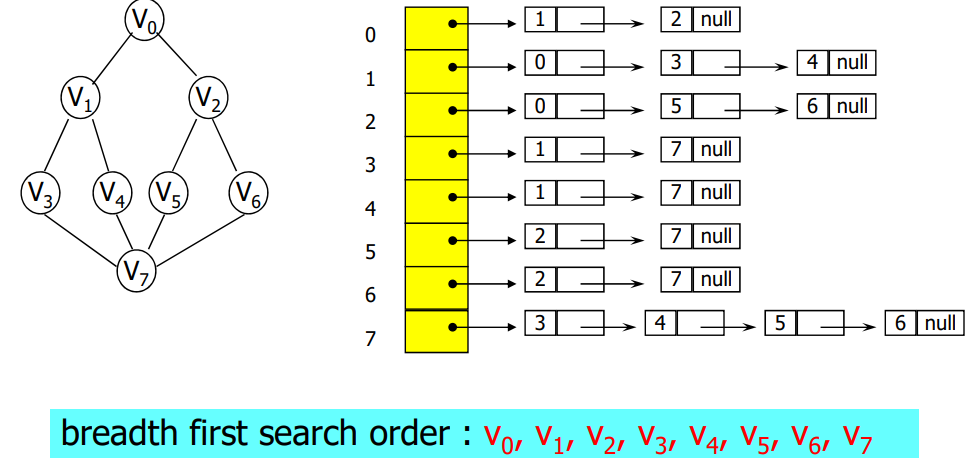
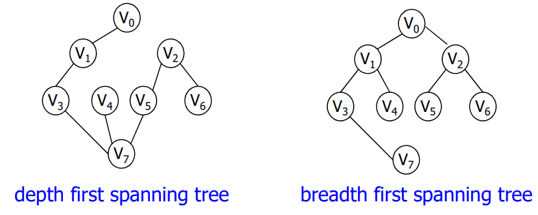
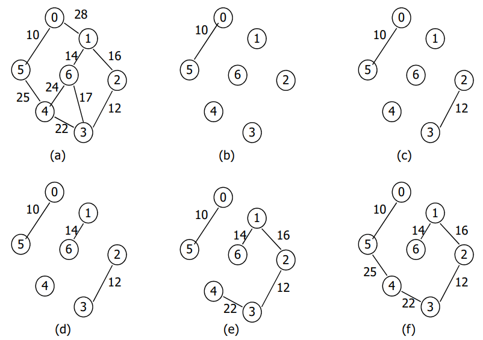
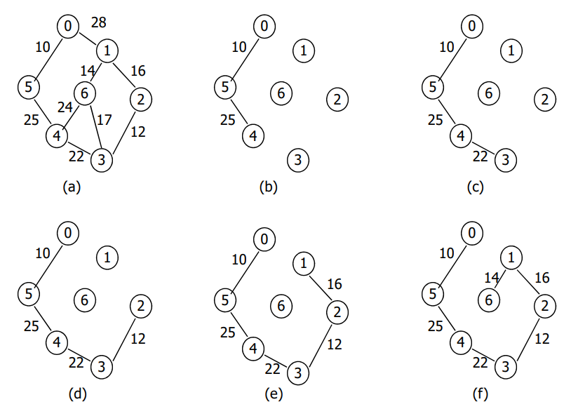
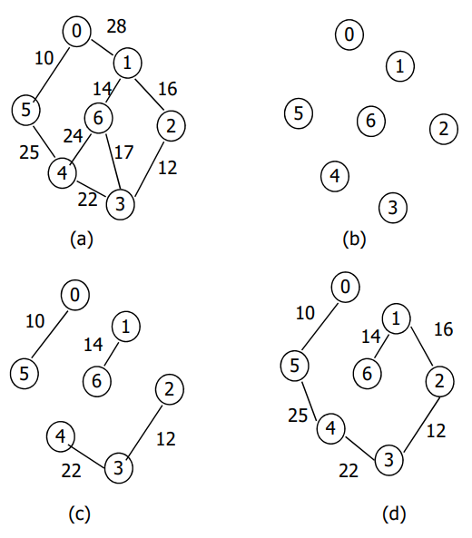

# Graph
#자료구조/Graph

---
## 그래프란?
- 연결되어 있는 객체 간의 관계를 표현하는 자료구조
- 그래프의 예: 지하철 노선도, 친구 관계, 컴퓨터 네트워크 등

## 그래프 데이터 타입
- 그래프 G의 두 가지 구성 요소
    - V(G): G에 포함된 vertex(정점)들의 집합
    - E(G): G에 포함된 edge(간선, 에지)들의 집합
    - G = (V, E)
- 무방향성 그래프(undirected graph)
    - Vertex의 쌍을 나타내는 edge가 방향성이 없음
    - (u, v), (v, u): 동일한 edge를 표현
- 방향성 그래프(Directed graph)
    - 각 edge에 방향성이 존재하는 그래프
    - <u, v>: u > v 인 edge를 표현
        - u = tail, v = head
    
### 그래프에서 사용되는 용어들
- 완전 그래프(Complete graph)
    - Edge의 수가 최대인 그래프
    - n개의 vertex -> 최대 edge 수 = n(n-1)/2
- 인접(adjacent), 부속(incident)
    - (u, v)가 undirected graph에서 edge일 경우
        - u와 v는 인접
        - Edge(u,v)는 vertex u와 v에 부속된다.
    - <u, v>가 directed graph에서 edge일 경우
        - u는 v에 인접한다.(u is adjacent to v)
        - v는 u로부터 인접한다.(v is adjacent from u)
- 부분 그래프(Subgrah)
    - V(G') ⊆ V(G) and E(G') ⊆ E(G) 일 겨우, G'는 G의 부분 그래프
- 경로의 길이 = 경로 상에 있는 edge의 수
- 단순 경로(simple path)
    - 처음과 마지막을 제외한 vertex가 다른 경로
- 사이클(cycle): 처음과 마지막이 동일한 단순 경로
- 연결(connected)
    - Vertex u와 v사이에 경로가 존재할 경우, u와 v는 연결
- 연결요소(connected component)
    - Maximal connected subgraph
- 트리 = Connected acyclic graph
- Vertex v의 차수(degree)
    - v에 부속된 edge의 수
    - 방향성 그래프
        - in-degree = v가 head가 되는 edge의 수
        - out-degree = v가 tail이 되는 edge의 수
- Digraph = Directed Graph

## 그래프 표현법

### 인접 행렬(Adjacency Matrix)
- A[n][n]
    - (u, v) ∈ E(G), A[u][v] = 1
    - Otherwise, A[u][v] = 0
- 무방향성 그래프: A[][]는 대칭 행렬
- 방향성 그래프: A[][]는 비대칭 행렬


- 대칭 행렬: A[n(n-1)/2]로 구현 가능

### 인접 리스트(Adjacency List)
그래프 의 vertex마다 하나의 연결 리스트가 존재



### 그래프 표현 방법들의 분석
- G에 존재하는 edge 수? 혹은 G가 연결되었는지 검사
    - 인접 행렬: n(n-1)/2 개의 항을 조사 -> O(n^2)
    - 인접 리스트: O(n+e)
        - Good if e << n^2/2 (sparese graphs)
- Digraph에서 vertex의 in-degree를 조사
    - 인접 행렬:O(n)
    - 인접 리스트: O(n+e)

## Depth First Search
- 출발 vertex, v의 인접 리스트부터 방문
- v에 인접하면서 아직 방문하지 않은 vertex, w를 선택
- w를 시작점으로 하여 다시 깊이 우선 탐색 시작
- recursion을 이용하여 구현
```c
#define FALSE 0
#define TRUE 1
short int visited[MAX_VERTICES];

void dfs(int v)
{
    struct node * w;
    visited[v] = TRUE;
    printf("%5d", v);
    for( w = graph[v]; w; w= w->link)
        if(!visited[w->vertex]) dfs(w->vertex);
}
```



## Breadth First Search
- 출발 vertex, v의 인접 리스트 부터 방문
- v에 인접한 모든 vertex들을 먼저 방문
- 그다음, v에 인접한 첫번째 vertex에 인접한 vertex중에서 아직 방문하지 않은 vertex들을 다시 차례대로 방문(Queue를 이용)

```c
struct queue{
    int vertex;
    struct queue *link;
};
void addq(...);
void deleteq(...);

void bfs(int v)
{
    node_pointer w;
    struct queue *front = NULL, *rear = NULL;

    printf("%5d", v);
    visited[v] =TRUE;
    add(&front, &rear, v);
    while(front){
        v = delete();
        for( w = graph[v]; w; w= w->link){
            if(!visited[w->vertex]){
                print("%5d", w->vertex);
                addq(&front, &rear, w->vertex);
                visited[w->vertex] = True;
            }
        }
    }
}
```



## Spanning Trees
그래프 G에 포함된 edge들로 구성되며, G의 모든 vertex들을 포함하는 트리



## Biconnected Components and Articulation Points
- 단절점(articulation point)
    - 그래프에서 어느 edge 삭제했을 때 그래프가 두개 이상의 connected component들로 분할되는 vertex
- 이중 결합 그래프
    - 단절점이 없는 connected graph

## Articulation Point 조사
- DFS 트리의 루트가 두 개의 children을 가질 경우, 루트 vertex는 articulation point임
- W의 descendants로 가서 back edge를 이용해 W의 ancestor에 갈 수 없을 경우 articulation point

## 최소 비용 신장트리
- 가중치가 부여된 무방향 그래프에서 신장 트리의 비용 = 신장 트리를 구성하는 edge들의 비용의 합
- Minimum cost spanning tree: 가장 비용이 적은 spanning tree

Minimum cost spanning tree 제약 조건
- 그래프 내에 존재하는 edge들만 사용
- n-1개의 edge만 사용(정점의 수 = n)
- Cycle을 형성할 수 있는 edge는 사용 불가

Minimum cost spanning tree를 구하기 위한 알고리즘
- Kruskal, Prim, Solin
- 세 가지 알고리즘 모두 greedy method를 사용

## Kruskal Algorithm
- 한번에 하나의 edge씩 추가하면서 최소비용 트리 T를 생성
- Edge들을 비용의 오름차순으로 정렬한 후, 가장 비용이 적은 edge부터 선택
- 선택된 edge는 기존에 선택된 edge들과 사이클을 형성하지 않을 경우에만 T에 포함
- 총 n-1개의 edge 선택



비용이 최소인 edge를 어떻게 찾을까?
- Edge들을 비용 순서대로 정렬: O(e log e)
- 개선된 방법: min heap을 이용
    - 다음 차례의 edge를 발견: O(log e)
    - heap의 구성: O(e)

Cycle 검사
- union-find 연산을 이용

## Prim Algorithm
- 단 하나의 vertex만 갖는 트리 T에서 시작
- 각 단계에서 트리를 구성하도록 한번에 하나의 edge를 선택
- T에 포함된 vertex와 포함되지 않은 vertex를 연결하는 edge들 중에서 비용이 최소인 edge를 T에 추가
- 시간 복잡도 = O(n^2)



## Solin Algorithm
- 단계별로 T에 포함시킬 여러 edge들을 동시에 선택
- 각 단계에서 선택된 edge들은 그래프의 spanning forest를 구성
- 초기에는 edge가 없으므로, forest에 vertex 수 만큼의 트리가 존재
- 각 단계에서 forest에 있는 각트리에 대해 하나의 edge를 선택(선택 기준: 최소 비용)
- 두 개의 트리에서 동일한 edge를 선택할 수 있으므로, 중복된 edge를 제거하는 절차 필요
- 하나의 트리만 남거나, 혹은 추가할 edge가 없을경우 종료



## Dijkstra의 Algorithm
알고리즘의 구성
- 0에서 n-1까지 n 개의 vertex가 존재
- S를 표현하기 위하여 found[n] 배열을 사용
- 인접 행렬 cost[n][n]을 이용하여 그래프 G를 표현
    - cost[i][j]: <i,j>의 비용
- <i,j>가 없을 때, cost[i][j]를 충분히 큰 값으로 설정
- 실제로 존재하는 edge들의 비용보다 큰 값
- distance[u] + cost[u][w]의 결과로 overflow가 발생하지 않도록 주의
- 시간 복잡도 = O(n^2)
```c
#define MAX_VERTICES 6
int cost[][MAX_VERTICES] = 
{{ 0, 50, 10, 1000, 45, 1000},
{ 1000, 0, 15, 1000, 10, 1000},
{ 20, 1000, 0, 15, 1000, 1000},
{ 1000, 20, 1000, 0, 35, 1000},
{ 1000, 1000, 30, 1000, 0, 1000},
{ 1000, 1000, 1000, 3, 1000, 0}};
int distance[MAX_VERTICES], n = MAX_VERTICES;
short int found[MAX_VERTICES];

void shortestpath(int v, int cost[][MAX_VERTICES], int distance[], 
                    int n, short int found[])
{       // Dijkstra의 Algorithm을 구현
    int i, u, w;
    for (i = 0; i < n; i++) 
    { found[i] = FALSE; distance[i] = cost[v][i]; }

    found[v] = TRUE;
    distance[v] = 0;
    for (i = 0; i < n – 2; i++) {
        u = choose(distance, n, found); // w  S 중에서 최단 경로 선택
        found[u] = TRUE;
        for (w = 0; w < n; w++)
            if (found[w] == FALSE) // 관찰 3을 구현
              if (distance[u] + cost[u][w] < distance[w])
                    distance[w] = distance[u] + cost[u][w];
} }

int choose(int distance[], int n, short int found[])
{
/* 아직 S에 포함되지 않은 vertex중에서 최소 거리를 갖는
vertex를 return */
    int i, min, minpos;
    min = INT_MAX;
    minpos = -1;
    for (i = 0; i < n; i++)
        if (distance[i] < min && found[i] == FALSE) {
             min = distance[i];
                minpos = i;
      }
    return minpos;
}
```

## All Pairs Shortest Paths
그래프 G에 포함된 모든 vertex의 쌍들에 대해 최단 경로를 발견
1. V(G)에 속하는 각각의 vertex에 대해 Dijkstra 알고리즘을 수행: 복잡도 O(n^3)
2. 동적 프로그래밍 방법: 복잡도 O(n^3) with smaller constant factor

```c
void allcosts (int cost[ ][MAX_V], int distance[][MAX_V], int n)
{
/* 각 vertex에서 나머지 모든 vertex까지의 최단 경로를 계산. cost[][]: 인접 행렬, distance[][]: 경로의 거리를 저장 */
    int i, j, k;

    for (i = 0; i < n; i++)
        for (j = 0; j < n; j++)
            distance[i][j] = cost[i][j]; // A-1[][]의 초기화
    for (k = 0; k < n; k++)             // A0 부터 An-1까지 차례대로 생성
        for (i = 0; i < n; i++)
            for (j = 0; j < n; j++)
            if (distance[i][k] + distance[k][j] < distance[i][j])
                 distance[i][j] = distance[i][k] + distance[k][j];
}
```