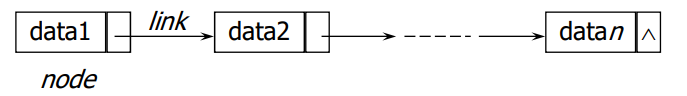
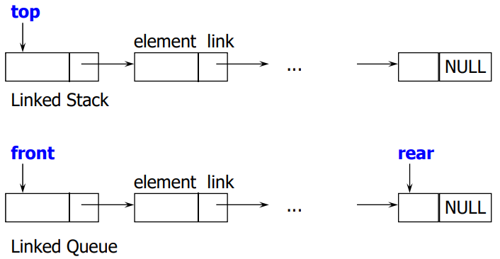

# Lists
#자료구조/Lists

---
## Pointers
순서화 리스트의 배열을 이용한 순차적 구현
- 임의의 위치에 대한 삽입과 삭제 연산이 곤란
- 가변 길이의 순서화 리스트 지원 불가

순서화 리스트의 연결 리스트를 이용한 구현
- 리스트의 연속된 항목들은 메모리의 임의의 장소에 위치
- 리스트는 연결된 노드들로 구성
    - 각 노드는 데이터와 링크로 구성
    - 링크는 리스트의 다음 노드를 가르킴



## 단일 연결 리스트(Singly Linked Lists)
연결 리스트의 표현
- 각 노드들은 메모리의 인접한 곳에 위치하지 않는다.
- 각 노드의 주소는 프로그램 실행시 매번 틀릴 수 있다.

*리스트의 이름 = 첫 번째 노드의 주소

삽입과 삭제
- 기존 노드들의 위치를 변경할 필요가 없다.
- 링크 필드를 위한 추가적인 메모리 공간 필요

```c
//자기 참조 구조체를 이용
struct node {
    int data;
    struct node *link;
};
struct node * ptr = NULL;
ptr = (struct node *) malloc(sizeof(struct node));
```

```c
//리스트에 삽입
void insert(struct node **start, struct node *before)
{
    struct node * temp;
    temp = (struct node *)malloc(sizeof(struct node));
    if(temp == NULL)
    {
        fprintf(stderr, "The memory is full\n");
        exit(1);
    }
    temp->data = 50;
    if(*start != NULL){
        temp->link = before->link;
        before->link = temp;
    }
    else{
        temp->link=NULL;
        *start=temp;
    }
}
```

```c
리스트에서 노드 삭제
void delete(struct node **start, struct node *before, sturct node *A)
{
    if(before != NULL)
        before->link = A->link;
    else
        *start = (*start)->link;
    free(A);
}
```

## 배열과 연결리스트의 비교
저장 방식의 차이
- 배열: int A[4]; <- 메모리의 인접한 곳에 저장
    - 다음 데이터에 대한 주소를 알 필요 없음
- 연결 리스트: struct node에 대한 네번의 malloc
    - 각 노드들은 메모리의 여러 곳에 나누어 저장
    - link 포인터를 이용하여 다음 노드의 주소 유지

메모리 사용 측면
- 저장될 데이터의 수를 안다면 배열이 효과적
- 데이터의 수를 모를 경우, 연결 리스트가 유리

정렬된 데이터의 유지
- 배열
    - 데이터가 추가될 때 기존 데이터의 위치 변경
    - 이진 검색 가능
- 연결 리스트
    - 기존 데이터의 위치 변경은 발생하지 않음
    - 이진 검색은 불가능


## 리스트를 이용한 스택과 큐
배열을 이용한 스택과 큐의 구현 방법의 문제점
- 메모리 낭비
- Stack Full의 발생 가능성




```c
//리스트 이용한 스택의 선언
typedef struct {
    int key;
}element;
struct stack {
    element data;
    struct stack *link;
};

struct stack *top;
```
- 스택의 초기 조건: top = NULL;
- 경계조건:
    - top = NULL if stack is empty.
    - IS_FULL(temp) if the memory is full.

```c
//리스트 스택에 노드 추가
void push(element item)
{
    struct stack * temp = (struct stack*) malloc(sizeof(struct stack));
    ikf(temp == NULL) {
        fprintf(stderr, "The memory is full\n");
        exit(1);
    }
    temp->data = item;
    temp->link = top;
    top = temp;
}
```

```c
//리스트 스택에서 삭제
element pop()
{
    // 스택의 top이 가리키는 element를 삭제하여 return
    struct stack *temp = top;
    element item;
    if (temp == NULL) {     // top == NULL
        fprintf(stderr, "The stack is empty\n");
        exit(1);
    }
    item = tempdata;
    top = templink;
    free(temp);
    return item;
}
```

```c
//리스트를 이용한 큐의 선언
typedef struct {
    int key;
} element;
struct Que {
    element data;
    struct Que *link;
};
struct Que *front, *rear;
```
- 큐를 위한 초기 설정: front = NULL;
- 경계 조건:
    - front = NULL if queue is empty.
    - IS_FULL(temp) if the memory is full.

```c
//리스트 큐에 노드 추가
void addq(element item)
{
    struct Que *temp = (struct Que *) malloc(sizeof(struct Que));
    if (temp == NULL) {     // memory full
        fprintf(stderr, "The memory is full\n");
        exit(1);
    }
    temp->data = item;
    temp->link = NULL;
    if (front) rearlink = temp;
    else front = temp;
    rear = temp;
}
```

```c
//리스트 큐에서 삭제
element deleteq()
{
    // 큐에서 front가 가리키는 노드 삭제 후 element는 return
    struct Que *temp = front;
    element item;
    if (temp == NULL) {  // *front == NULL
        fprintf(stderr, "The queue is empty\n");
        exit(1);
    }
    item = temp->data;
    front = temp->link;
    free(temp);
    return item;
}
```