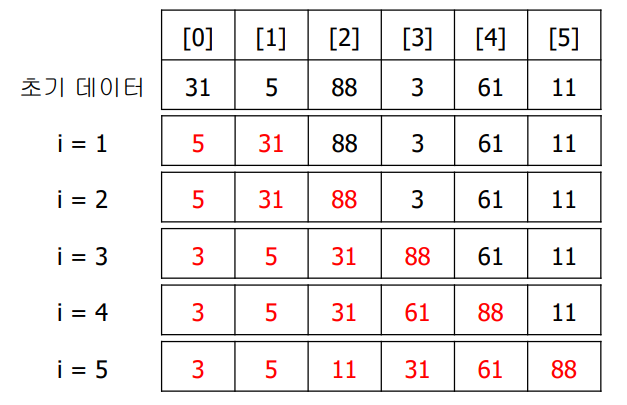
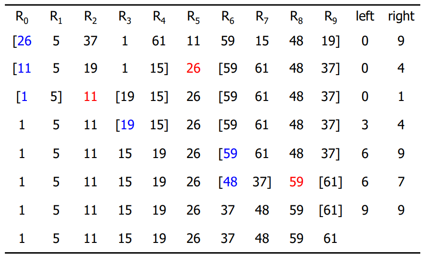
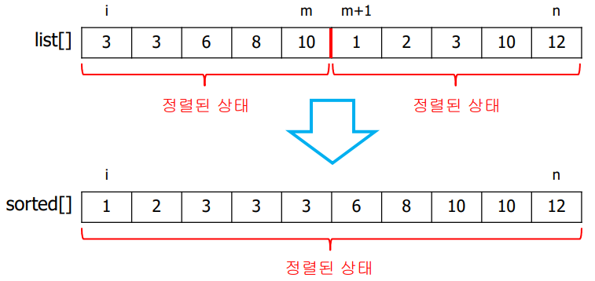
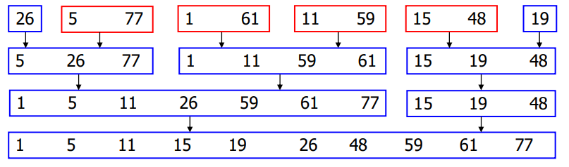
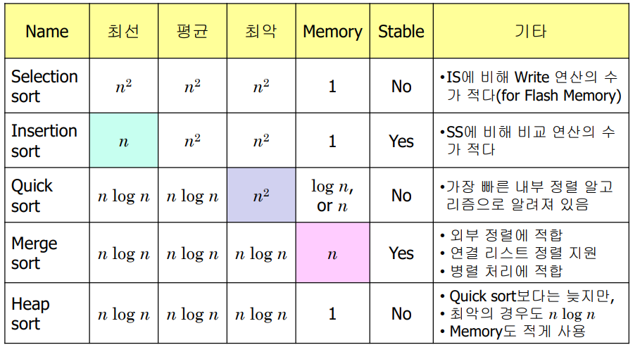

# Sorting
#자료구조/Sorting

---
## 삽입 정렬(Insertion Sort)
기본 개념
- Sorting된 리스트에 새로운 데이터를 추가
- 레코드를  추가할 때 기존 데이터의 위치 변경

Selection Sort 와의 비교
- Complexity: O(n^2)
- Selection Sort: 데이터의 크기 비교
- Insertion sort: 데이터의 빈번한 위치 변경

```c
void insertion_sort(int list[ ], int n)
// n개의 데이터를 저장하는 list[] 배열에서 삽입 정렬 수행
{
    int i, j;
    int next;
    for ( i = 1; i < n; i++) { // 0부터 i-1까지는 정렬된 상태
        next = list[i]; // i번째 데이터가 들어갈 위치 파악
        for (j = i – 1; j >= 0 && next < list[j]; j--)
             list[j+1] = list[j]; // 큰 데이터들은 아래로 이동
        list[j+1] = next;
    }
}
```

### 동작 과정



### 삽입 정렬의 분석
데이터 수가 n개일 때 성능
- 최악 - 비교 연산: n^/2, 교환 연산: n^/2  (내림차순일때)
- 최선 - 비교 연산: n 교환 연산: 0 (오름차순일때)

### 삽입 정렬의 변형
- Binary Insertion Sort
    - 비교 대상을 binary search
    - 위치 변경 수는 동일
- List insertion sort
    - 데이터의 위치 변경 오버헤드 없음
    - But, binary search 불가

## Qucik Sort
기본 개념
- 각 단계마다 기준값(pivot key)보다 작은 부분과 큰 부분으로 데이터를 분할
- 분할된 부분에 대해 다시 기준 값을 정해 분할
- Sort algorithm 중 average performance가 가장 좋음

```c
void quicksort (int list[ ], int left, int right)
// list[left], …, list[right]까지 오름차순으로 정렬. // list[left] 를 기준 값(pivot key)으로 선정
// list[left] <=> list[right + 1] 라고 가정

{
    int pivot, i, j;
    int temp;
    if (left < right) {
        i = left; j = right + 1;
        pivot = list[left];
        do {
        // pivot을 중심으로 왼쪽과 오른쪽 리스트 생성
        // 왼쪽 리스트: pivot보다 적은 키들을 저장, 오른쪽은 반대
                do // 왼쪽부터 pivot보다 큰 키를 검색
                    i++;
                while (list[i] < pivot);
                    do // 오른쪽부터 pivot보다 작은 키를 검색
                    j--;
                while (list[j] > pivot);
                if ( i < j ) // 각 리스트의 속성을 만족하도록 데이터 교환
                    SWAP( list[i], list[j], temp );
        } while ( i < j );
        SWAP( list[left], list[j], temp );
        quicksort( list, left, j – 1 ); // 왼쪽 리스트를 다시 정렬
        quicksort( list, j + 1, right ); // 오른쪽 리스트를 다시 정렬
} }
```

### quicksort()의 동작 과정



### Qucik Sort 알고리즘의 성능
- 최선의 경우: O(nlog(2)n)
    - T(n) = 2 * T(n/2) + n – 1
    - T(1) = 1
- 최악의 경우: O(n^2)
    - 오름차순으로 정렬이 되어 있는 크기가 n인 배열
    - W(n) = W(0) + W(n – 1) + n – 1
    - W(0) = 0
- 평균적인 경우: O(n^log(2)n)

## 합병 정렬(Merge Sort)
합병(Merging)
- list[i]...list[m]과 list[m+1]...[list[n]]은 정렬된 리스트
- 두 리스트를 합병하여 정렬된 sorted[i]...sorted[n]를 생성



```c
void merge (int list[ ], int sorted[ ], int i, int m, int n)
{   // list[i], …, list[m]과 list[m+1], …, list[n]은 각각 정렬된 리스트
    // 두 개의 리스트를 병합하여 정렬된 sorted[i], …, sorted[n]를 생성
    int j = m+1, k=i; // i: 첫 번째 리스트 색인, j: 두 번째 리스트 색인
                        // k: sorted[]의 색인
    while ( i <= m && j <= n) {
        if (list[i] <= list[j])
                 sorted[k++] = list[i++];
            else sorted[k++] = list[j++];
    }
    if ( i > m) // 두 번째 리스트의 나머지를 sorted[]에 복사
       for (; j <= n; j++) sorted[k++] = list[j];
    else // 첫 번째 리스트의 나머지를 sorted[]에 복사
        for (; i <= m; i++) sorted[k++] = list[i];
}
```

### Iterative Merge Sort
```c
void merge_pass (int list[ ], int sorted[ ], int n, int length)
{ // Merge sort의 한 패스 수행
    /* list[n] 배열에서 길이가 length인 인접한 한 쌍의 서브리스트를 합병하여 sorted[] 배열에 저장. */

    int i, j;
    for (i = 0; i + 2 * length – 1 < n; i += 2 * length)
        merge (list, sorted, i, i + length – 1, i + 2 * length – 1);

    //길이가 2*length보다 적게 남아있는 서브리스트들을 병합
    if (i + length < n) // 하나 = length, 나머지 < length
       merge (list, sorted, i, i + length – 1, n – 1);
    else // 하나의 서브리스트만 남아있는 경우
        for ( j = i; j < n; j++)
             sorted[j] = list[j];
}

void merge_sort (int list[ ], int n )
// list[n] 배열을 오름차순으로 정렬
{
    int length = 1; // 합병될 서브리스트의 길이
    int extra[MAX_SIZE];

    while (length < n) {
        merge_pass (list, extra, n, length);
        length *= 2;
        merge_pass (extra, list, n, length);
        length *= 2;
    }
}
```

### Recursive Merge Sort
```c
typedef struct {
    int key;
    int link;
} element;

int rmerge (element list[ ], int lower, int upper )
// list[lower], …, list[upper]까지 오름차순으로 정렬. // 각 레코드의 link filed는 초기에 -1로 설정
{
    int middle;
    if (lower >= upper)
        return lower;
    else {
        middle = (lower + upper) / 2;
        return listmerge(list, rmerge(list, lower, middle),
                         rmerge(list, middle+1, upper));
    }
}

int listmerge (element list[ ], int first, int second)
// first와 second가 가리키는 서브리스트들을 합병
{
    int start = n;
    while (first != -1 && second != -1) {
        if (list[first].key <= list[second].key) {
                list[start].link = first; start = first; 
                first = list[first].link;
        }
        else {
            list[start].link = second; start = second; 
            second = list[second].link;
    } }
    if (first == -1)
         list[start].link = second;
    else list[start].link = first;
    return list[n].link; // 합병된 리스트의 시작 인덱스를 return
}
```

### Merge Sort에 대한 나머지 이야기들
- Merge Sort의 변형
     - 전체 데이터를 scan 한 후, sorting 된 데이터들을 하나의 리스트로 간주



- Merge Sort의 성능 (Stable sort algorithm)
    - Complexity: worst/average case - O(nlog(2)n)
    - 단점: Space overhead - O(n)

## Heap Sort
특징
- Require only a fixed amount of additional storage
- Worst/Average case computing time = O(nlog(2)n)
- Space complexity = O(1)

기본개념
- MAX heap에 n 번의 insert&delete: O(nlog(2)n)
```c
void adjust (int list[ ], int root, int n)
{   // root를 제외한 트리의 나머지 부분은 max heap으로 이미 구성
    // list[root]의 위치를 조정하여 max heap을 재구성

    int rootkey = list[root], child = 2 * root; // left child

    while (child <= n) {
        if ((child < n) && (list[child] < list[child+1]))
            child++; // 왼쪽 또는 오른쪽 중에서 큰 값을 child로 설정.
        if (rootkey > list[child]) break;
        else {
            list[child / 2] = list[child]; // child가 클 경우 부모 자리로.
            child *= 2;
        }
    }
    list[child / 2] = rootkey;
}

void heapsort (int list[ ], int n)
{ // list[1]부터 list[n]까지를 오름차순으로 정렬
    int i, j;
    int temp;

    for (i = n/2; i > 0; i--) // 초기 max heap을 구성
        adjust (list, i, n); // n/2은 child를 갖는 첫번째 노드
    for (i = n-1; i > 0; i--) {
        SWAP (list[1], list[i+1], temp); // root를 맨 뒤의 원소와 교환
        adjust (list, 1, i); // 원소를 하나 적게 가진 heap을 재구성
    }
}
```
- First for loop = O(n)
- Second for loop: O(nlogn)

## Sorting Algorithmdml 비교

