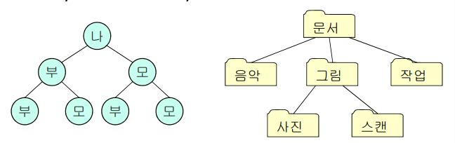
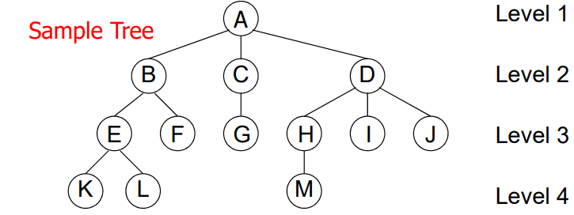
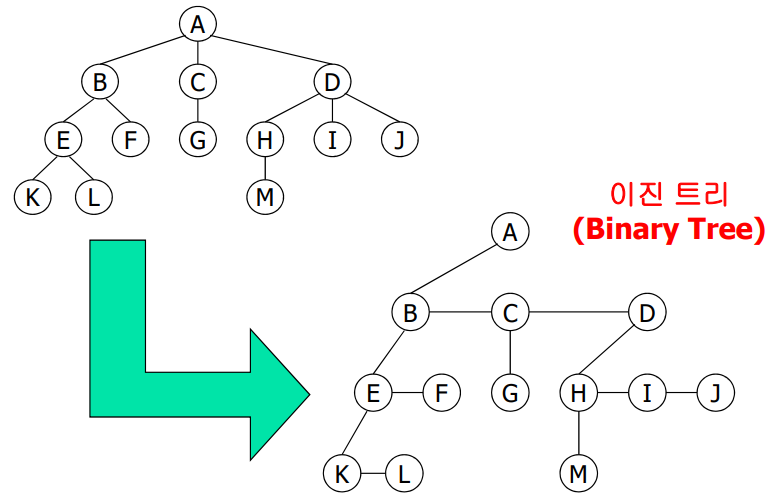
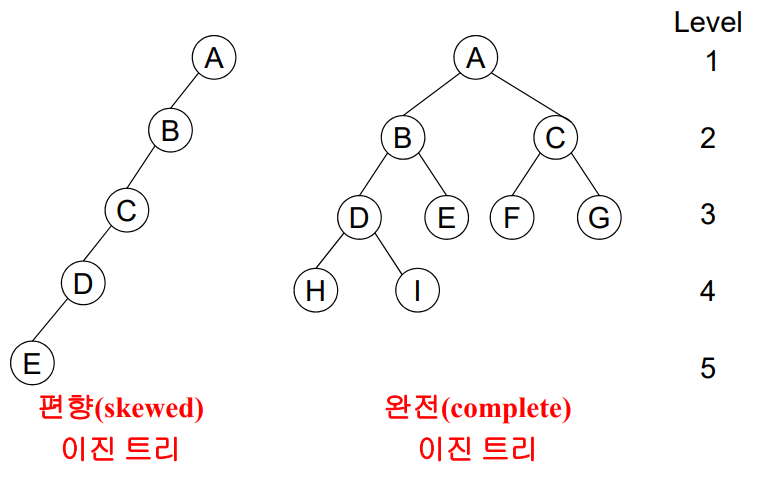
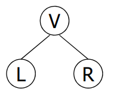
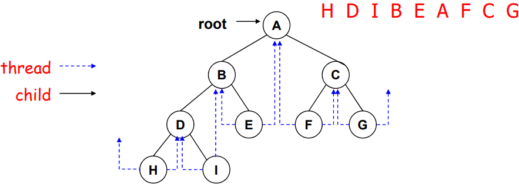
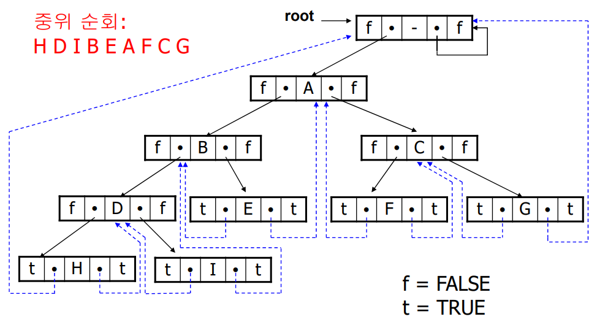
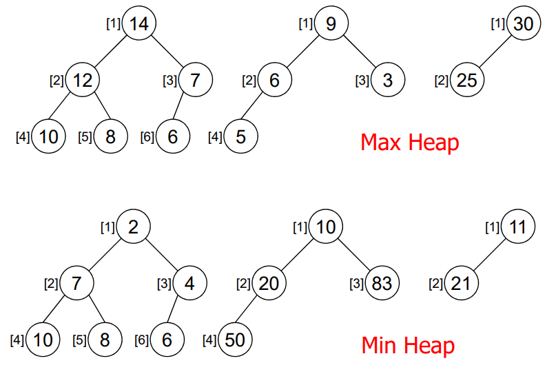

# Trees
#자료구조/Trees

---
## Introduction
트리란?
- 계층적 구조의 자료를 표현할 때 사용



- 하나 이상의 노드로 이루어진 유한집합
- Root라고 하는 노드가 존재



- 노드의 차수(degree): A - 3
- 단말 노드(leaf or terminal node) : K, L, F, G, M, I, J)
- Parent: E - B, Children: B - E & F, Siblings: E & F
- Ancestor: (M: H, D, A), Descendants: (B: E, F, K, L)
- Height or Depth: 4

## 트리의표현
Left Child - Right Sibling 표현
- 노드 A의 제일 왼쪽 노드 -> A의 왼쪽 자식 노드
- A의 나머지 자식 노드들 -> 자식 노드의 오른쪽 자식
- 트리의 모든 노드마다 2개의 링크 필드만 포함




## 이진 트리
- 모든 노드의 차수는 2를 넘지 않는다
- 왼쪽 서브트리와 오른쪽 서브트리가 구분

이진 트리의 정의
- 유한 개의 노드들의 집합으로서
    - 노드 수는 0이 될수 있으며,
    - 하나의 root 노드와 왼쪽 서브트리, 그리고 오른쪽 서브트리로 구성
    - 각 서브트리는 다시 이진 트리

### 편향 트리와 완전 이진 트리



### 이진 트리의 성질
최대 노드 수
- 이진 트리의 레벨i에서 최대 노드 수는 2^i-1
- 깊이가 k인 이진 트리가 가질수 있는 최대 노드 수는 2^k-1

단말 노드 수와 차수가 2인 노드 수
- 단말 노드 수 = 차수가 2인 노드의 수 + 1

깊이가 k인 포화 이진 트리
- 깊이가 k이고 노드 수가 2^k-1 인 이진 트리

n개의 노드를 가진 완전 이진 트리가 순차적으로 표현되어 있다면
- parent = i/2
- Lchild = 2i
- Rchild = 2i + 1

## 이진 트리 순회(Binary Trree Traversal)
이진 트리의 모든 노드를 한번씩 방문



세가지 순회 방법
- 중위 순회(inorder traversal)
    - L -> V -> R
- 전위 순회(preorder traversal)
    - V -> L -> R
- 후위 순회(postorder traversal)
    - L -> R -> V

### 이진 트리의 복사
후위 순회 알고리즘 응용

```c
tree_pointer copy(struct node *original)
{ // original 트리를 복사한 새로운 이진 트리를 반환
    struct node *temp;
    if (original) {
    temp = (struct node *) malloc(sizeof(struct node));
    temp->left_child = copy(original->left_child); 
    temp->right_child = copy(original->right_child);
    temp->data = original->data;
    return temp;
    }
    return NULL;
}
```

### 이진 트리의 동일성 검사
전위 순회 알고리즘을 응용

```c
int equal(struct node *first, struct node *second)
{
    /* first와 second 트리가 다를 경우 FALSE를 반환. 트리가 동일할 경우, TRUE를 반환 */
    return ((!first && !second) || (first && second &&
    (first->data == second->data) &&
    equal(first->left_child, second->left_child) &&
    equal(first->right_child, second->right_child)));
}
```

### 이진 트리의 노드 수 계산

```c
int get_node_count(struct node *ptr)
{
int count = 0
    if (ptr != NULL)
        count = 1 + get_node_count(ptrleft_child) +
            get_node_count(ptrright_child);
    return count;
}
```

### 단말 노드 수 계산

```c
int get_leaf_count(struct node *ptr)
{
    int count = 0;
    if (ptr != NULL) {
        if (ptr->left_child == NULL && 
            ptr->right_child == NULL) // 단말 노드
                return 1;
        else count = get_leaf_count(ptrleft_child) + 
                        get_leaf_count(ptrright_child);
    }
    return count;
}
```

## Threaded Binary Tree
기본개념
- n개의 노드를 갖는 이진 트리에는 2n개의 링크가 존재
- 2n개의 링크 중 n + 1 개의 링크 값은 null
- Null 링크를 다른 노드에 대한 포인터로 대체

Thread의 이용
- ptr->left_child = Null일 경우, ptr->left_child를 ptr의 inorder predecessor를 가리키도록 변경
- ptr->right_child = Null일 경우, ptr->right_child를 ptr의 inorder successor를 가르키도록 변경

### 노드의 구조
```c
struct thread_tree {
    short int left_thread; // true or false
    struct thread_tree *left_child; // left_thread = true: thread
                                    // left_thread = false: left child
    char data;
    short int right_thread;
    struct thread_tree *right_child;
}
```


### Threaded Binary Tree의 Head Node
Head Node의 역활
- 가장 왼쪽 노드의 inorder predecessor
- 가장 오른쪽 노드의 inorder successor



### Threaded Binary Tree에서 Inorder Traversal
- ptr이 현재 노드를 가르킬 때
    - If ptr->right_thread == TRUE
        - Inorder successor of ptr = ptr->right_child
    - Otherwise
        - ptr의 right_child로 간 다음, left_child를 따라 계속 내려간다
        - left_thread == TRUE인 노드를 만날 때 까지

```c
struct thread_tree *insucc(struct thread_tree *ptr)
{
    /* Threaded binary tree에서 ptr이 가리키는 노드의 inorder successor
    를 return */

    struct thread_tree *temp = ptrright_child;

    if (!ptr->right_thread)// right_child가 child pointer
        while (!temp->left_thread) // 왼쪽 끝까지 가자
            temp = temp->left_child;
    return temp;
}

void tinorder (struct thread_tree *tree)
{
    // Threaded binary tree를 inorder traversal

    struct thread_tree *temp = tree;

    for ( ; ; ) {
        temp = insucc(temp);
        if (temp == tree) 
            break;
        printf("%3c", temp->data);
    }
}
```

### Threaded Binary Tree에서 노드 추가
- 새로운 노드를 parent노드의 right child로 추가
- parent->right_thread 값이 true/false일 경우 고려

```c
void insert_right(struct thread_tree *parent, struct thread_tree *child)
{ // Threaded binary tree에서 parent의 오른쪽에 child 추가
    struct thread_tree *temp;

    child->right_child = parent->right_child;    // child의
    child->right_thread = parent->right_thread;   // 정보부터
    child->left_child = parent;                  // 변경
    child->left_thread = TRUE;                   // 하자.
    parent->right_child = child;
    parent->right_thread = FALSE; // child가 존재하므로 thread는 false
    if (!child->right_thread) {
        temp = insucc(child); // parent의 원래 successor를 찾아서
        temp->left_child = child; // 새로운 predecessor로 변경
} }
```

## Heaps
최대 트리와 최대 히프
- 최대 트리(max tree): "트리의 모든 노드에 대해"
    - 부모 노드의 데이터 값 >= 자식 노드의 데이터 값
- 최대 히프(max heap)
    - 최대 트리이면서 완전 이진 트리

최소 트리와 최소 히프
- 최소 트리(min tree): "트리의 모든 노드에 대해"
    - 부모 노드의 데이터 값 <= 자식 노드의 데이터 값
- 최소 히프(min heap):
    - 최소 트리이면서 완전 이진 트리



### Max Heap에 노드 삽입
Max heap은 배열로 구현
- 배열의 끝에 새로운 노드 추가
- 추가된 위치의 parent부터 root 노드까지 비교하면서 max heap 재구성

시간 복잡성 = O(log2n)
```c
void insert_max_heap(element item, int *n)
{
    // 노드 수가 *n인 max heap에 item 값을 추가
    int i;
    if (HEAP_FULL(*n)) {
        fprintf(stderr, "The heap is full. \n");
        exit(1);
    }
    i = ++(*n);
    while ((i != 1) && (item.key > heap[i/2].key)) {
        heap[i] = heap[i/2]; // parent의 값을 아래로 이동
        i /= 2; // 한 레벨 위로 이동
    }
    heap[i] = item;
}
```

### Max heap에서 노드 삭제
기본 개념
- Heap에서의 삭제는 항상 root node에서만 발생
- Root node를 삭제한 후, heap을 재구성

삭제 알고리즘의 구현 방법
- Root node를 삭제한 후, 마지막 노드를 root로 변경
- Root node부터 아래로 순회하면서 노드들의 값을 비교하여 max heap을 재구성

시간 복잡성 = O(log2n)

```c
element delete_max_heap (int *n)
{
    int parent, child;
    element item, temp;

    if (HEAP_EMPTY (*n)) { fprintf(stderr, "The heap is empty\n"); exit(1); }
    item = heap[1];
    temp = heap[ (*n)-- ]; // 제일 마지막 원소를 비교 대상으로…
    parent = 1; child = 2; // root node부터 시작
    while (child <= *n) {
        if ((child < *n) && (heap[child].key < heap[child+1].key))
             child++; // 두 개의 children 중에 큰 쪽과 비교
        if (temp.key >= heap[child].key) break; // 더 이상 내려갈 필요없음
        heap[parent] = heap[child]; // child의 데이터를 위로 이동
        parent = child; // 아래로 내려가자
        child *= 2;
    }
    heap[parent] = temp;
    return item;
}
```
