# Cache and Memory Systems
#컴퓨터 구조/Cache and Memory Systems

---
## Basic Structure of a Memory Hierarchy

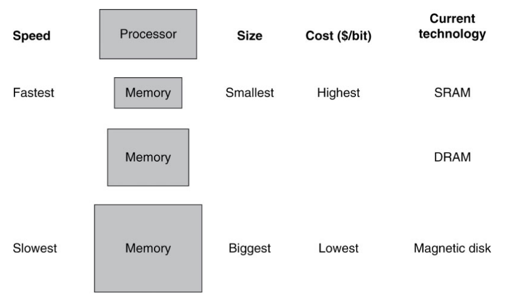

### Memory Hierarchy Technologies
- (Volatile) Random Access Memories (RAMSs)
    - "Random" is good: access time is the same for all locaions
    - DRAM: Dynamic Random Access Memory
        - High density(1 transistor cells), low power, cheap, slow
        - Dynamic: need to be "efreshed" regulary
    - SRAM: Static Random Access Memory
        - Low density(6 transistor cells), high power, expensive, fast
        - Static: content will last "forever" (until power turned off)
- (Nonvolatile) Random Flashes (SSD, EEPROMs)
    - read is faster than erase/write, and finite number of erase cycles
- (Nonvalatile) "Non-random" Access Technology
    - Access time varies from location to location and from time to time(e.g., HDD Disk, CDROM)

### DRAM Memory Latency & Bandwidth

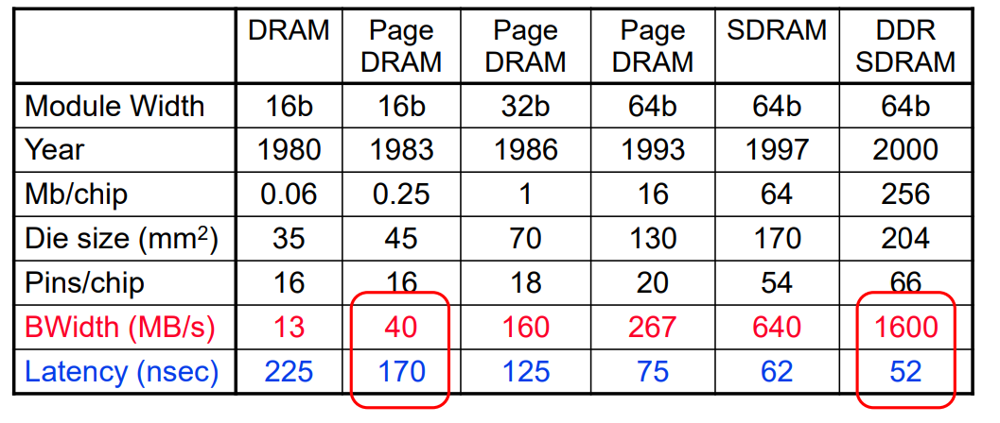

- In the time that the memory to processor bandwidth has doubled or more, the memory latency has improved by a factor of only 1.2 to 1.4

## Disk Sectors and Access
Access to a sector involves following overhead:
- Queuing delay (scheduling delay) if other accesses are pending
- Seek: move the heads
- Rotational latency
- Data transfer
- plus any necessary controller overhead

### Magnetic Disk Characteristic

Disk read/write components
1. Seek time: position the head over the proper track
2. Rotational latency: wait for the desired sector to rotate under the head
3. Transfer time: transfer a block of bits
4. Controller time: the overhead the disk controller imposes in performing a disk I/O access

## Flash Storage (SSD, Solid-State Drive)
Nonvolatile semiconductor storage
- faster than disk
- Smaller, lower power, more robust

## Flash Types
- NOR flash: bit cell like a NOR gate
    - High speed memory
    - Random read/write access
    - Read/Write level: Byte
    - Used for insturction memory in embedded systems or firmware storage
- NANd flash: bit cell like a NAND gate
    - High density memory & Cheaper per GB
    - Random read/write access
    - Read/Write level: Page vs. Erase level: Block
    - Used for data storage (USB memory, media storage, ...)

### Flash Memory Characteristics
- Flash bits wears out after 1000's of accesses
    - Life time is usually 10,000 ~ 100,000
    - Not suitable for direct RAM or disk storage
    - Wear leveling: remap data to less used blocks
- Operation time of NAND flash memory : Asymmetric
    - Read : 20us, Write : 200us, Erase : 1.5ms
- Two types of NAND Flash
    - Small block NAND Flash
        - 528byte (512byte page + 16byte spare area) * 32 = 1 block
    - Large block NAND Flash
        - 2112byte (2048byte page + 64byte spare area) * 64 = 1 block

### SSD Architecture

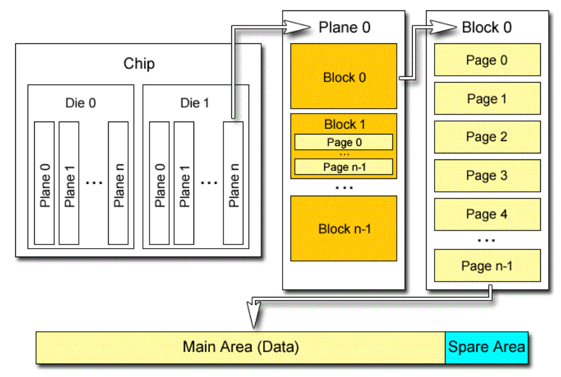

### Wear Leveling in SSD
Maintains a wear leveling table, which contains the number of erases for each block

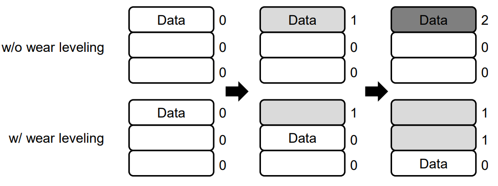

### Erase-before-write in SSD
Erase-before-Write
- In initial state of SSD, it can be written any 1/0 values to SSD cell
- Once written, you can change 1 -> 0, but can not change 0 -> 1
- So you have to erase first before write new value
    - Erase operation makes all cells to 1 again
    - So we say program operation, not erase operation in SSD

Different operation level
- Erase : block level, Write : page level
- Page size is 1KB ~ 8 KB size
- Block is composed of 64~512 pages

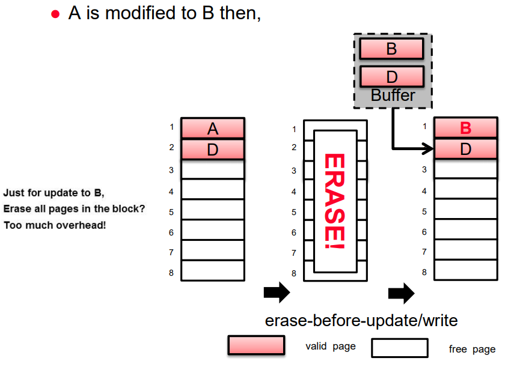

### Out-place-update in SSD
Erase-before-Write
- Too much overhead

Out-place-Update

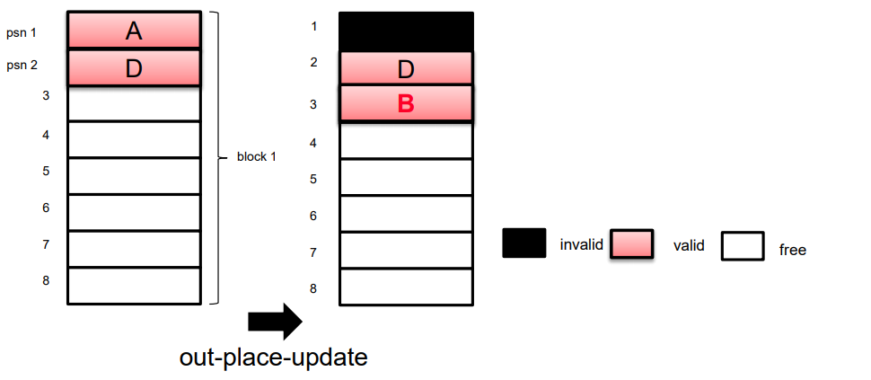

- Mark the page which has an old value as Invalid and write a new value in a free page
- If no free page? : Garbage Collection

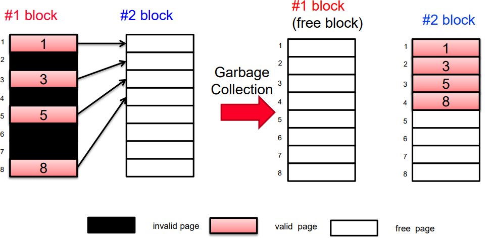

### Address Mapping in SSD
Address mapping in SSD has to translate corresponding block and page, cascadingly

## FTL (Flash Translationn Layer)
How to use and manage the flash memory as a new storage system by Operating System, campared to traditional storages(HDD), concerning these unique feature of Flash Memory?
- (choice 1) Use file systems for flash memory
- (choice 1) Use FTL

### FTL implementation
To provide unique feature of SSD, FTL manages overall operations of SSD

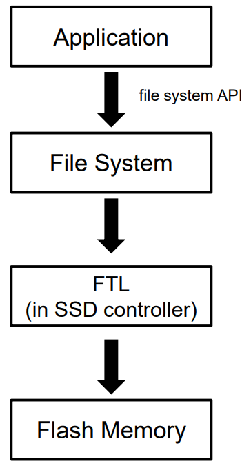

- FTL is embedded in products as a hardware
    - SD card, USB drives etc.
- FTL exists in a software layer as a part of OS

### SLC, MLC, and TLC in SSD
- The number of bit that cab e stored in each cell
    - SLC: 1 bit, MLC : 2bits, TLC: 3bits
- As the number of bit is increased
    - Increased density naturally
    - Decreased lifetime -> hard to control voltage level

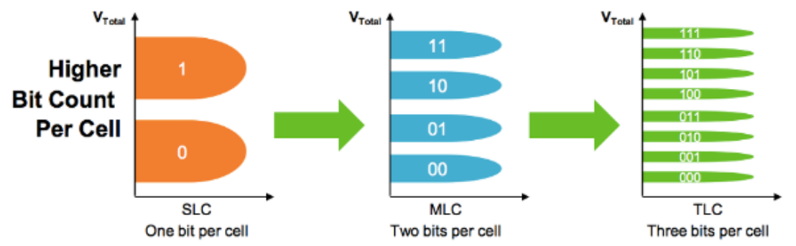

## The "Memory Wall"
Processor vs DRAM speed disparity continues to grow
- Physical time to access DRAM is reduced but clock speed(CPU portion) enhancement is much faster. So #clocks to access memory is increased.

Good memory hierarchy(cache) design is increasingly important to overall performance

### The Memory Hierarchy Goal
Large memories are slow and fast memories are small

How do we create a memory that gives the illusion of being large, fast and even cheap?
- with hierarchy
- with parallellism

### Memory Hierarchy & Locality
Take advantage of the principle of locality to present the user with as much memory as is available in the cheapest technology at the speed offered by the fastest technology

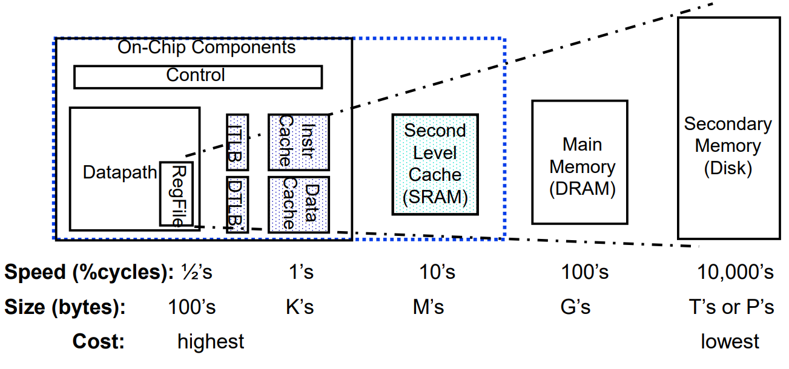

### Principle of Locality
Programs access a small proportion of their address space at any time
- Temporal locality
    - most recently accesed data
- Spatial locality
    - Items near those accessed recently

### Taking Advantage of Locality
- Memory hierarchy
- Store everything on secondary storage disk
- Copy recently accessed (and nearby) items from disk to smaller DRAM memory
- Copy more recently accessed (and nearby) items from DRAM to smaller SRAm memory
- Copy to Cache and Registers, and so on...

### Two Major Memory Performance Metrics
- Latency: Time to access one word
    - Access Time: time to take a read(or write) request
    - Cycle Time: time between successive(read or write) request
        - Access Time + Required time to trigger next request
    - Usually cycle time > access time
- Bandwith: How much data can be supplied per time unit
    - width of the data channel * the rate at which it can be used

### The Memory Hierarchy: Terminology
- Block (or line): the minimum unit of information that is present in a cache
- Hit Rate: the fraction of memory access found in a level of the memory hierarchy
    - Hit Time: Time to access data for that level, which consists of "Time to determine hit/miss + Time to access the block"
- Miss Rate: the fraction of memory access not found in a level of the memory hierarchy => "1 - (Hit Rate)"
- Miss Peanlty: time to replace a block in that level with the corresponding block from a lower level, which consists of Time to access the block in the lower level + Time to transmit that block to the level that experienced the miss + Time to inser the block in that level(replace 일어날때도 있음) + Time to pass the block to the requestor

Hit Time << Miss Penalty (Miss penalty is much longer than hit time)

On the contrary, it is very important that your Hit Time to be much smaller than your miss penalty
- That is, if hit time is long, the relative impact of miss penalty is small, and there is no need to build and maintain a memory hierarchy

---

## How is the Hierarchy Managed?
registres <-> cache
- by the compiler
- by the CPU

cache <-> main memory
- by the cache controller hardware
 
main memory <-> disks
- by the operating system

## Cache Basics
Direct mapped
- Each memory block is mapped to exactly one block in the cache
    - Therefore, lots of lower level blocks must share blocks in the cache
- Have a tag associated with each cache block that contains the address information(the upper portion of the address) required to identify the block
- Address mapping

### Caching: A Simple Example

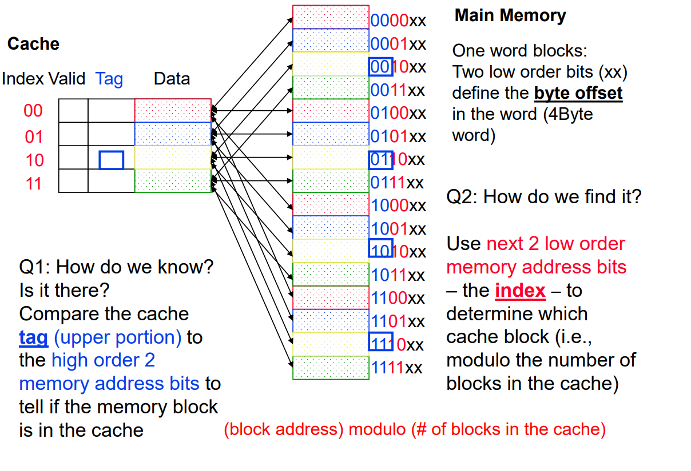

### Direct Mapped Cache example 2

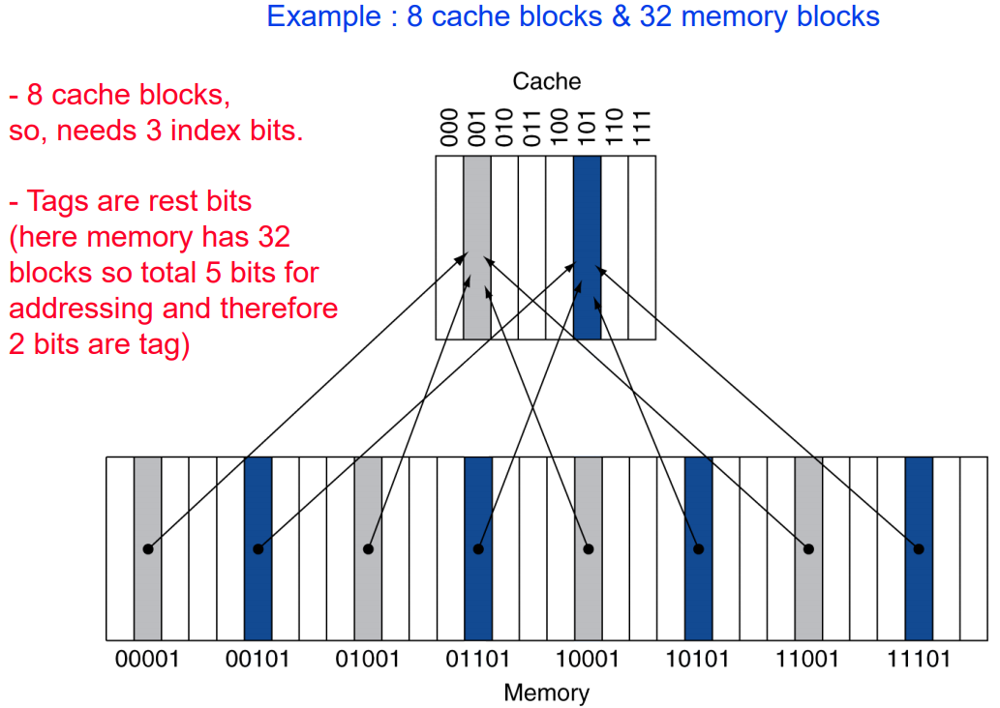

## Miss Rate vs Block Size vs Cache Size

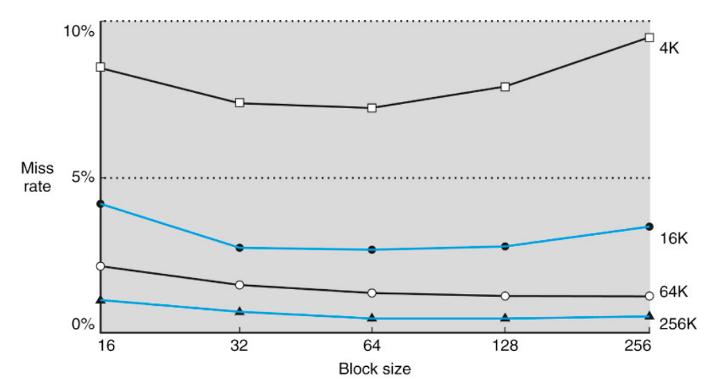

### Evaluation: Block Size Considerations
Larger blocks should reduce miss rate
- Increased cache line (multi-word line)
- Due to spatial locality

But in a fixed-sized cache,
- Larger blocks => fewer of them
    - More competition => increased miss rate (capacity miss)
    - This effect appears earlier as the cache size is small
- Also, too much larger blocks => pollution within the block

Larger block also suffers larger miss penalty
- Because the line size increased
- Can override benefit of reduced miss rate
- (advanced) early restart and critical-word first can help

## Cache Field Sizes (Hardware Overhead)
The number of bits in a cache includes both the storage for data and for tags(c.f., not index)
- The total number of bits in a direct-mapped cache is 2^n * (block size + tag field size + valid/dirty or any control field)

## Handling Cache Hits
Read hits(I$ and D$)

Write hits (D$ only): write through vs. write back
- require the cache and memory to be consisetent(write through)
    -  always write the data into both the  cache block and the next level in the memory hierarchy
    - writes run at the speed of the next level in the memory hierarchy - so slow - or can use a write buffer and stall only if the write buffer is full
    - Simple hardware, main memory is always up-to-date
- allow cache and memory to be inconsistent(write back)
    - write the data only into the cache block
    - write-back the cache block to the next level in the memory hierarchy when that cache block is "evicted"
    - need a dirty bit for each data cache block to tell if it needs to be written back to mememory when it is evicted - can also use a write buffer to help write of dirty blocks to lower level memory

## Sources of Cache Misses (3 Cs)
- Compulsory:
    - First access to a block
    - If you are going to run "millions" of instruction, compulsory misses are insignificant
    - Solution: increase block size
- Capacity:
    - Cache cannot contain all blocks accessed by the program
    - Solution: increase cache size
- Conflict(collision):
    - Multiple memory locations mapped to the same cache location
    - Solution 1: increase cache size
    - Solution 2: increase associativity