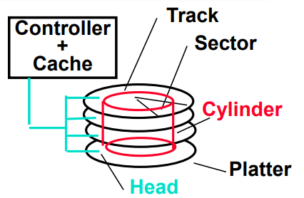

# Cache and Memory Systems
#컴퓨터 구조/Cache and Memory Systems

---
## Basic Structure of a Memory Hierarchy

### Memory Hierarchy Technologies
- (Volatile) Random Access Memories (RAMSs)
    - "Random" is good: access time is the same for all locaions
    - DRAM: Dynamic Random Access Memory
        - High density(1 transistor cells), low power, cheap, slow
        - Dynamic: need to be "efreshed" regulary
    - SRAM: Static Random Access Memory
        - Low density(6 transistor cells), high power, expensive, fast
        - Static: content will last "forever" (until power turned off)
- (Nonvolatile) Random Flashes (SSD, EEPROMs)
    - read is faster than erase/write, and finite number of erase cycles
- (Nonvalatile) "Non-random" Access Technology
    - Access time varies from location to location and from time to time(e.g., HDD Disk, CDROM)

### DRAM Memory Latency & Bandwidth

- In the time that the memory to processor bandwidth has doubled or more, the memory latency has improved by a factor of only 1.2 to 1.4

## Disk Sectors and Access
Access to a sector involves following overhead:
- Queuing delay (scheduling delay) if other accesses are pending
- Seek: move the heads
- Rotational latency
- Data transfer
- plus any necessary controller overhead

### Magnetic Disk Characteristic

Disk read/write components
1. Seek time: position the head over the proper track
2. Rotational latency: wait for the desired sector to rotate under the head
3. Transfer time: transfer a block of bits
4. Controller time: the overhead the disk controller imposes in performing a disk I/O access

## Flash Storage (SSD, Solid-State Drive)
Nonvolatile semiconductor storage
- faster than disk
- Smaller, lower power, more robust

## Flash Types
- NOR flash: bit cell like a NOR gate
    - High speed memory
    - Random read/write access
    - Read/Write level: Byte
    - Used for insturction memory in embedded systems or firmware storage
- NANd flash: bit cell like a NAND gate
    - High density memory & Cheaper per GB
    - Random read/write access
    - Read/Write level: Page vs. Erase level: Block
    - Used for data storage (USB memory, media storage, ...)

### Flash Memory Characteristics
- Flash bits wears out after 1000's of accesses
    - Life time is usually 10,000 ~ 100,000
    - Not suitable for direct RAM or disk storage
    - Wear leveling: remap data to less used blocks
- Operation time of NAND flash memory : Asymmetric
    - Read : 20us, Write : 200us, Erase : 1.5ms
- Two types of NAND Flash
    - Small block NAND Flash
        - 528byte (512byte page + 16byte spare area) * 32 = 1 block
    - Large block NAND Flash
        - 2112byte (2048byte page + 64byte spare area) * 64 = 1 block

### SSD Architecture

### Wear Leveling in SSD
Maintains a wear leveling table, which contains the number of erases for each block

### Erase-before-write in SSD
Erase-before-Write
- In initial state of SSD, it can be written any 1/0 values to SSD cell
- Once written, you can change 1 -> 0, but can not change 0 -> 1
- So you have to erase first before write new value
    - Erase operation makes all cells to 1 again
    - So we say program operation, not erase operation in SSD

Different operation level
- Erase : block level, Write : page level
- Page size is 1KB ~ 8 KB size
- Block is composed of 64~512 pages

### Out-place-update in SSD
Erase-before-Write
- Too much overhead

Out-place-Update

- Mark the page which has an old value as Invalid and write a new value in a free page
- If no free page? : Garbage Collection

