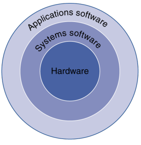
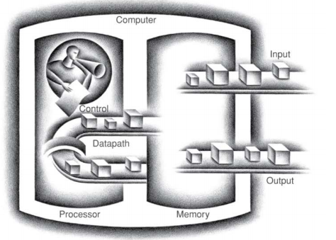
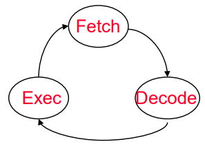
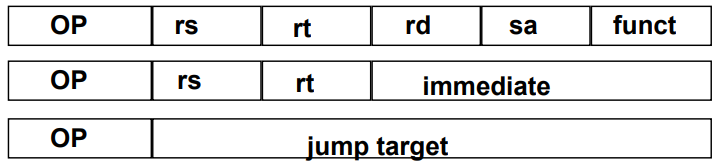

# Computer Abstarctions and Technology
#컴퓨터구조/Instruction

---
## Content
- 컴퓨터 시스템에 성능과 기능을 무엇이 결정하는지 배우자
- 컴퓨터 아키텍쳐와 이것의 소프트웨어 사이의 상호작용을 이해하자
    - understand the effects of their design choices on specific platform
    - best cost-performance

## What you will Learn
- How high-level programs are translated into the machine language
- The hardware/software interface
    - Programmers perspective
    - The concept of "programmer model(하드웨어에 관한 소프트웨어 프로그래머의 관점)"
- What determines program perfomance
- How hardware designer improve performance
- What is parallel processing

---
```
kilobyte - 2^10
megabyte - 2^20
gigabyte - 2^30
terabyte - 2^40
petabyte - 2^50
exabyte - 2^60
zetabyte, yotabyte...
```
---
## Question
1. 소프트웨어 프로그래머가 프로세서 구조와 메모리 같은 하드웨어에 대한
학습을 해야 하는 이유가 무엇인가?

    best cost-performance

2. 프로그래머 모델이란 무엇인가?

    하드웨어에 관한 소프트웨어프로그래머의 관점

3. 프로세서와 메모리의 발전 경향의 차이점은 무엇인가?

    Processor
    - logic capacity: increases about 30% per year
    - performance: 2x every 1.5 to 2years

    memory
    - dram capacity : 4x every 3  years about 60% per year
    - speed : 1.5x every 10years
    - cost per bit: decreases about 25% per year

    용량면에서 memory가 발전이 뛰어나지만 성능은 processor쪽

4. 칩 제조 과정의 절차를 간략히 이야기 해 보시오.

    silicon ingot -> slicer -> blank wafer -> 20 to 40 processing steps -> patterned wafers ->testing -> packaging -> customer

5. 컴퓨터 구조 교과를 학습함에 있어서 특정한 사례 위주로의 학습을 해야 하는 이유가 무엇인가?

    다양한 컴퓨터가 있기 때문에(컴퓨터마다 타입, 사용법, 제조사, 기술, 비용 이 다름)

---

## Why Learn this Thing?

 Both hardware and software affect performance
  - The algorithm determines the number of source-level statemnets
  - The language/compiler/architecture(CISC, RISC) determine the number of machine-level instructions
  - Operating System should schedule hte program
  - The Processor/memory determine how fast machine-level instrcutions are executed

---

## Question
1. 컴퓨터 시스템의 성능에 영향을 줄 수 있는 요소들은 무엇이 있는가?

    Algorithm, Language, Compiler, Architecture, Operating system, Processor, Memory

2. 알고리즘은 컴퓨터 시스템의 성능에 어떻게 영향을 미치는가?
(언어는? 컴파일러는? 운영체제는? 구조는? 그외?)

  

3. 각 타입별 컴퓨터의 특성은 어떻게 다른가?

    - Desktop(or laptop) computers: Designed to deliver good performance to a single user at low cost usually executing 3rd party software, usually incorporating a graphics display, a keyboard, and a mouse

    - Servers: Used to run larger programs for multiple, simultaneous      users typically accessed only via a network 

    - Supercomputers: A high performance, high cost class of servers with hundreds to thousands of processors, terabytes of memory and petabytes of storage that are used for high-end scientific and engineering applications

    - Embedded computers(processors): A computer, which is inside another device, used for running one predetermined application

4. 임베디드 프로세서가 가지는 독특한 특성은 무엇인가? 

    - often have minimum performance requirements
    - often have stric limitations on cost
    - often have strict limitations on power consumption
    - often have low tolerance for failure

5. 자동차 안에 구현된 임베디드 프로세서의 사례를 제시하시오.

    gps, display systems, audio systems ...

6. Eight great idea가 각각 무엇을 의미하는지 이야기 해 보시오.

    - Design for Moore's Law via integration
    - Use abstraction to simplify design
    - Make the common case fast (the most important in eight great idea)
    - Performance via parallelism
    - Performance via pipelining
    - Performance via prediction
    - Hierarchy of memories
    - Dependability via redundancy

---

## Below Your Program



Application software
- Written in high-level language

System software
- Operating system - supervising program that interfaces the user's program with the hardware

- Compiler - translate programs into instructions that the hardware can execute

Hardware
- Processor, memory, I/O controllers

## Levels of Program Code
High-level-language --compiler(One to Many)--> Assembly language program --assembler(One to One)--> binary machine language program

## Advantages of Higher-Level Languages
- Think in a more natural language
- productivity
- maintainability
- independent of the computer

## Computer Components
- processor (datapath and control)
- memory (cache as SRAM, main memory as DRAM, disk storage as HDD or SSD)
- input
- output
- interconnection or network






1. Input으로 들어온 binary code는 processor에서 요청하고 처리할때까지 main memory에 대기(fecth)
2. Control decodes the instruction to determine what to execute(decode)
3. Pathpath executes the instruction as directed by cnotrol(execute)

## Processor organization
Control needs to have circuit to
- Decide which is the next instruction
- Decode the instruction
- Issue signals that control the way
- Control the functional unit

Datapath needs to have circuit to
- Execute instructions
- Interconnect the functional units
- Load data from and store data to memory

---
## Question
1. 컴퓨터 시스템의 큰 실행 흐름을 이야기 해 보세요.

    High-level language program을 compiler를 통해 assembly language program으로 바꾸고 그걸 assembler가 binary machine language program으로 바꿔서 input을 통해 main memory에 저장시킨뒤 fetch가 되면 control에서 decode를 해서 data path로 주고 data path에서 execute 하고 store을 하면 memory를 통해 output으로 빠져나감

2. 어셈블러의 역할은 무엇인가?

    Assembly language program을 binary machine language program으로 변환


---
## Instruction Set Architecture(ISA)
ISA - Abstract Interface between the highest level hardware and the lowest level software

ex) ARM, IA-32(x86) - CISC 구조 , MIPS - RISC 구조

ABI - ISA + OS interface

## The MIPS ISA

### Instruction Categoreis 
- Computational ( + / * - )
- Load/Store
- Jump and Branch

### 3 Instruction Formats: all 32 bits wide



---

## 멀티코어 프로세서가 대두된 배경

성능을 높이려고 클락을 높혔더니 전기를 너무 많이 먹음

## Multi-core also challenges
Hard for programmers to write explicitly parallel programs
- task scheduling with load balancing
- minimal communication
- synchronization overhead

## Performance Metrics
System purchasing perspective
- best performance?
- least cost?
- best cost/performance?

System Design perspective
- best performance improvement?
- least cost?
- best cost/perofrmance?