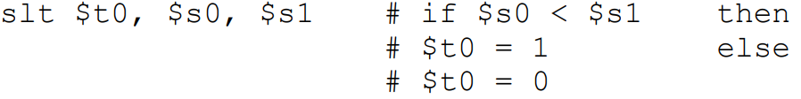

# ISA for MIPS
#컴퓨터구조/ISA for MIPS

---
## RISC  - Reduced Instruction Set Computer
RISC philosophoy
- fixed instruction lengths
- load-store instruction sets
- limited number of addressing modes
- limited number of operations

The effciency of Instruction sets are measured by how well compilers use them efficiently(not measured by how well assembly language programmers use them easily)

## The Four Design Principles
1. Simplicity favors regularity
2. Smaller is faster
3. Make the common case fast
4. Good Design demands good compromises

## Two Key Principles of Machine Design
1. Instructions are represented as numbers and, they are indistinguishable from data
2. Programs are stored in alterable memory just like

## MIPS-32 ISA

3 Instruction Formats: all 32-bit wide

---
## MIPS Instruction Fields

||||
-|-|-|
|op|6-bits|opcode that specifies the operation|
rs|5-bits|register first source
rt|5-bits|register second source
rd|5-bits|register destination
shamt|5-bits|shift amount
funct|6-bits|function code
-> In total 32bits R-type Instruction

## MIPS Register File

Holds thirty-two 32-bit registers
- Two read ports
- One write port

Registers are
- Faster than main memory
- Easier for a compiler to use register file, compared to stack
- Can hold variables with improved code density

## MIPS Memory Access Instructions

lw $t0, 4($s3) #load word from memory

sw $t0, 8($s3) #store word to memory

The data is loaded into or stored from a register in the register file - a 5 bit address

The memory address - a 32 bit address - is formed by adding the contents of the base address register to the offset value
- A 16-bit offset field

### Load Instruction(I-type)

### Store Instruction(I-type)

---
## Byte addresses
Alignment restriction - the memory address of a word must be on natural word boundaries

### Big Endian
: 시작주소에 MSB

ex) MIPS, HP DA-RISC (RISC)

### Little Endian
: 시작주소에 LSB

ex) Intel, ARM (CISC)

- 기계입장에서 Little Endian이 친숙
- 인간이 읽기에는 Big Endian이 편함

---
## Loading and Storing "Bytes"
lb $t0, 1($s3) #load byte from memory

lw $50, 6($s3) #stroe byte to memory

What 8 bits get loaded and stored?
- load -  레지스터 가장 오른쪽에 8 bit load 나머지는 zero-extend
- store - 레지스터 가장 오른쪽은 memory에 4곳중 아무곳에 넣고 나머지는 건드리지 않음

## I format 에서 덧셈
addi $sp, $sp, 4   #$sp = $sp +4

immediate에 4 저장

slti $t0, $s2, 15 #$t0 = 1 if $s2 < 15

### The constant is kept inside the instruction itself
- 16 bits Immediate format limits values to the range 2^15-1 to -2^15
- Small number is Common Case

## How About Larger Constants?
### Use two instructions(lui + ori)

- a new "load upper immediate" instruction
    - lui $t0, 1010101010101010

- Then must get the lower order bits right, use
    - ori $t0, $t0, 1110111011101110

-> Increase IC but not common case

## Sign Extension
Representing a number using more bits
 - Should preserve value after extension

 In MIPS instruction set, which needs extension
 - addi: extend immediate value
 - lb, lh: extend loaded byte/halfword
 - beq, bne: extend the displacement

 Replicae the sign bit to the left

 

## Instruction Format Encoding
Can reduce the complexity with multiple formats by keeping them as similar as possible

## Shift Operations - logcial shift
Need for shift operation
- Need operations to pack and unpack 8-bit char/number/data into 32-bit words (by zero extension)
- Although it has a constant, it is R format instruction

Such shifts are called logical because they fill with zeros
- 5-bit shamt field is enough to shift a 32-bit value
    - shift operation use R type
    - Shif operation does not use rs field, but use rt/rd/shamt

## Shift Operations - arithmetic shift
An arithmetic shift(sra) maintain the arithmetic correctness of the shifted value
- sra uses sign extension
- There is no need for a sla
    - sll works for arithmetic left shifts

## AND Operations : masking
Useful to mask bits in a word
- Select some bits, clear others to 0

## OR Operations : including
Useful to include bits in a word
- Set some bits to 1, leave others unchanged

## NOT Operations : converting
NOT operation is useful to invert bits in a word
- Change 0 to 1, and 1 to 0

NOT operation is also used to implement NOR
- a NOR b == NOT (a or b)

NOR with zero is same as NOT operation

~[(Some value) or (00.00)] = ~ (some value)

## Instructions for Making Decisions
Decision making instructions
- alter the control flow
- change the "next" instruction to be executed

MIPS conditional branch instructions:

- bne/beq uses I format
- First two operands are sources(rs, rt)
- Instruction Format(I format): Label field is immediate

How is the branch destination address specified?
- 16 bit offset is used for branch distance

Note that various uses of offset field
- Memory address offset for lw & sw
- Immediate constant value
- Branch offset for target(branch distance)

## Specifying Branch Destinations
Use a register and add its value with 16-bit offset
- which register? Instruction Address Register (PC register)
    - its use is automatically implied by instruction
    - PC gets updated (PC+4) during the fetch cycle so that it holds the address of the next instruction
- limits the branch distance to -2^15 to +2^15-1 instructions(that is word, not byte)

The contents of the updated PC (PC+4) is added to the 16 bit branch offset which is verted into a 32 bit value
 - concateanting two low-order zeros to mae kit a word address
 - and then sign-extending with those 18 bits
 

Concatenating two lower order zeros?
- branch distance -2^13 to +2^13-1 -> -2^15 to +2^15-1

## In Support of other Branch Instructions

### We can use slt, beq, bne, and the fixed value of 0 in register $zero to create other conditions

### Pseudo branch instructions : blt, ble, bgt, bge 
- These instructions are not included in the ISA (only as a pseudo) because its too complicated (Make common case fast!)
- It would stretch the clock cycle time or it would take extra clock cycles per instruction. 
- Two faster instructions are a better choice (RISC concept).

## Unconditional Jump
MIPS also has an unconditional branch instruction or jump instruction:

Instruction Foramt(J Format)

How is the jump destination address specified?
- As an absoulte address formed by
  - concatenating 00 as the 2 low-order bits to make it a word address
  - concatenating the upper 4bits of the currently updated PC(PC+4)

MSB 4 bit is not changed, So maximum jump distance is 256MB(2^28)