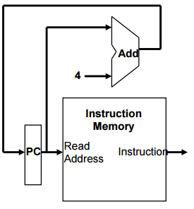
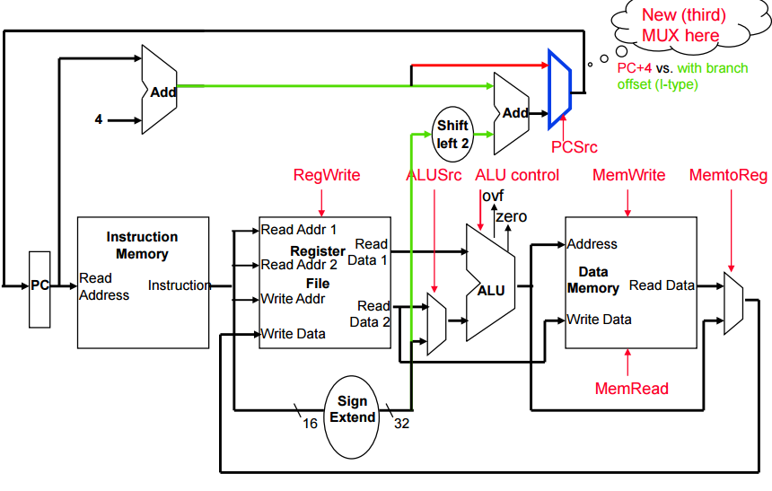

# Processor Architecture
#컴퓨터구조/Processor Architecture

---
## MIPS Processor Architecture and Pipeline Implementation
CPU performance factors
- instruction count
    - Determined by ISA and compiler
- CPI, Cycle time
    - Determined by CPU architecture

Two Mips implementations
- A simplified version
- A more realistic pipelined version

Simple subset, shows most aspects
- Arithmetic/logical: add, sub, and, or, slt
- Memory reference: lw, sw
- Control transfer: beq, j

### Logic Design Basics
Inforemation encoded in binary
- Low voltage = 0, High voltage = 1
- One wire per on bit
- Multi-bit data can be encoded on multiwire logics

Combinational element
- Operate on data
- Output is a function of input data

State(sequential) elements
- Store information
- Output is a function of input data and state

### Simple Instruction Execution Step
By using PC(program counter, instruction address)
- Access Instruction Memory(IM) and fetch instrcution

By using register numbers
- Access register file with register number(not address)

Depending on instruction class
- Use ALU to calcaulate
    - Arithmetic result
    - Memory address for load/store
    - Branch target address
- Access Data Memory(DM) for load/store
- (PC <- PC+4) or (PC <- branch target address)

### Abstract Implementation View
Two types of functional units:
- elements that operate on data values (combinational logic)
- elements that contain state (sequential logic)


Single cycle operation
- All 5 modules here execute in a Long Single cycle

- Split memory model - one memory for instructions and one memory for data(IM vs DM, Harvard Architecture)

### Clocking Methodologies
Clocking methodology defines when signals can be read and when they can be written


State element design choices
- level sensitive latch
- edge-triggered flip-flops

### The processor: Datapath & Control

All instructions (except j) use the ALU after reading the registers
- arithmetic use the ALU to do the required arithmetic operation
- memory reference use ALU to compute memory addresses
- control use the ALU to compute branch conditions and target address calculation

## Fetching Instrutions
- reading the instruction from the instruction memory
- updating the pc value to be the address of the next instruction



- PC is updated every clock cycle, so it does not need an explicit write control signal
- There is no need to use read control signal in Instruction Memory because it produces instruction every cycle

## Decoding Instructions
- First sending the fetched instructions opcode and function field bits to the control unit


- Second, reading two values from the Register File
    - Two values: Rs and Rt

## Executing R Format Operations
R format operations(add, sub, slt, and, or)
- perfrom operation (op and funct) on values in rs and rt
- store the result back into the Register File(into location rd)


- Note that register File is not written every cycle, so we need and explicit write control signal(RegWrite) for the Register File

## Executing Load and Store Operation


## Executing Branch Opreations
- compare the operands read from the Register File during decode( rs and rt values) for equality (zero ALU ouput)
- compute the branch target address by adding the updated PC to the sign extended 16-bit offset filed in the instruction
    - "base register" is the updated PC
    - offset value in the low order 16 bits of the instruction must be shifted left 2 bits to turn it into a word address and sign extended to create a 32-bit signed value


## Executing Jump Operations
- replace the lower 28 bits of the PC with the lower 2 6 bits of the fetched instruction shifted left by 2 bits(word offset)
- Concatenate with upper 4 bit in PC


## Creating a Single Datapath from the Parts
- Assemble the datapath segments and add control lines and multiplexors as needed
- Single cycle design - fetch, decode and execute each instrutions in one clock cycle
    - datapath resource cannot be used more than once per instruction, so some must be duplicated
    - multiplexors needed at the input of shared elements with control lines to do the selection
    - clock distribution to each module is also needed
    - write control signals is necessary to control writing to the Register File and Data Memory within single long cycle time
- Cycle time is determined by length of Longest Path



### Clock Distribution


## adding the Control
- Selecting the operations to perform(ALU, Register File ..)
- Controlling the flow of data(multiplexor inputs)


Observations
- op field always bits 31-26
- Addr. of registers to be read are always specified by the rs field(bits 25-21) and rt field(bits 20-16) in R-type. For LD, read rs[mem] and wirte to rt. For ST, read rt and write to rs[mem]
- addr. of register to be written is in one of two places - in rd(bits 15-11) for R-type instructions, in rt(bits 20-16) for lw
- offset for BEQ, LD and ST always in bits 15-0

### Complete Datapath with ALU Control Unit


### ALU Control, Con't
Controlling the ALU uses of multiple decoding levels
- main control unit generates the ALUOp bits(2bits) to ALU control
- ALU control unit
    - Input: 6bit funct field + 2bit ALUop -> Output ALUcontrol bits(4 bits) to ALU


## Instruction Critical Paths
Calculate cycle time
- Instruction and Data Memory(4 ns)
- ALU and adders(2 ns)
- Reigster File access(reads or writes) (1 ns)


### Single Cycle Disadvantages & Advantages
- Uses the clock cycle inefficiently(waste)
- Anyway, this approach is simple and easy to understand

## How Can We Make It Faster?
- Start fetching and executing the next insturction before the current one has completed
    - Pipelining - (most of all) modern processors are pipelined for performance
- Under ideal conditions and with a large number of instructions, the speedup from pipelining is approximately equal to the number of pipelined stages
- Fetch more than one instruction at a time?
    - Superscalar processing

### A Pipelined MIPS Processor
- Start the next instruction before the current one has completed
    - improves throughput - total amount of work done in a given time
    - insturction latency is not reduced


- clock cycle(pipeline stage time) is limited by the slowest stage
- for some intructions, some stages are wasted cycle
    - ex) sw has no job in WB, R-type has no job in Mem

### Pipeline Speedup
- If all stages are "balanced"
    - all take the same time
    - Time between instructions(pipelined) = Time between instructions(nonpipelined)/ Number of stages
- If not balanced, speedup is less
- Speedup is due to increased throughput by making all modules in busy state
    - but latency time does not reduced for each instruction

## Pipelining the MPIS ISA
What makes it easy in our MIPS architecture to make a pipelined processor
- Because of mostly RICS features, such as
    - all instructions are the same length (32 bits)
    - few instruction formats (three)
    - memory operations occur only in loads and stores
    - each instruction writes at most one result
    - operands must be aligned in memory so a single data transfer takes only one data memory access

### MIPS Pipeline Datapath Additions/Mods

State registers between each pipeline stage to isolate them


- state regsiters are inserted between the state
- System clock is triggered to every sequential modules as well as newly inserted stage register, except IM
- PC can be thought of as a pipelin register
    - the one that feeds IF stage of the pipeline
    - Unlike all of the other pipeline registers, the PC is part of the visible architecture state
    - PC is included in programmer's model


- Any information that is needed in a later pipe stage must be passed to that stage via a pipeline register
    - register address should continuously passed through the pipeline and feed back again(green)
    - load instruction
- The only data flow from right tl left(purple)
    - (1) Loaded data from DM to RF
    - (2) Selection of the newxt value of PC
- Later instructions in the pipeline can be influenced by these two REVERSE data movements
    - The first one (WB to ID stage for LD ins) leads to data hazards
    - tHE Second one (MEM to IF for branch ins) leads to control hazards
    - Because of these reverse movements, HAZARDs happen

### Multicycle Implementation Overview
- Each instruction step takes 1 clock cycle
    - Therefore, an instruction takes more than 1 clock cycle to complete
- Not every instruction takes the same number of clock cycles to complete
    - R type ALU operation : 5 cycles but 1 stall in the middle (DM)
    - SW : 4 cycles with no operation in WB
    - Conditional branch is 4 cycles & Jump is 2 cycles 
- Reading from or writing to any of the internal registers, Register File, or the PC occurs at the beginning (for write) or the end of a clock cycle (for read)

### Multicycle Advantages & Disadvantages
- Uses the clock cycle efficiently - the clock cycle is timed to accommodate not the slowest instruction but the slowest insturction step
- Multicycle implementations allow
    - faster clock rates
    - functional units to be used more than once as long as they are used on different clock cycles, thus need only one memory, one ALU/adder and ...
- However, it requires additional internal state registers, muxes, and more complicated (FSM) control

---
## Can Pipelining Get Us Into Trouble?
- Pipeline Hazards
    - Structural hazards: attempt to use the same hardware resource by two different insturctions at the same time
    - data hazards: attempt to use data before it is ready
    - control hazards: attempt to make a decision about program control flow before the condition has been evaluated
- Can usually resolve hazards by waiting
    - pipeline control must detect the hazard
    - and take action to resolve hazards

### A Single Memory Would Be a Structural Hazrd


Fix with separate instr and data memories
- Necessity of Harvard architecture

### How About Register File Access (structural hazard) ?


Fix register file access hazard by doing

Reads in the second half of the cycle and Writes in the first half cycle

### Data Hazards


- Green is OK but Red is hazard
- Red hazard is called Read after Write data hazard (RAW hazard)

### One Way to "Fix" a Data Hazard (stall)


### Another Way to "Fix" a Data Hazard


Although WB has final result of $1, ALU output has also updated final result -> Forwarding or Bypassing

## Data Forwarding (or Bypassing)
- Take the result from the earliest point that it exists in any of the pipeline state registers and forward it to the functional units that need it
- For ALU functional unit: the inputs can come from any pipeline register rather than just from previous ID/EX by
    - adding the multiplexors to the inputs of the ALU
    - adding the proper control hardware to control the new muxes
    - connecting the Rd in latter stage registers(previous instructions) such as EX/MEM or MEM/WB into either of the Rs and Rt in EX stage, as ALU mux inputs

        -> "to-ALU" forwarding
        - EX forwading : ALU to ALU (R to R result forwarding)
        - MEM forwarding : DM to ALU (load use hazard)

### Forwarding Illustraiton


### Yet Another Complication
Another potential data hazard can occur when there is a conflict between the forward path - which should be forwarded?


- Second add has to be forwarded!(최근께 forward 되야됨)

## Forwarding with Load-use Data Hazard (LW-USE)


### Load-use Hazard Detection Unit (DM-to-ALU forwarding)
Even with Forwarding Unit, we need a Hazard detection Unit in the ID stage to insert one stall between the load and it use

```HDL
ID Hazard detection Unit:
if (ID/EX.MemRead
and ((ID/EX.RegisterRt = IF/ID.RegisterRs)
or (ID/EX.RegisterRt = IF/ID.RegisterRt)))
then stall the pipeline //this is inevitable!
```
- After this one cycle stall, the forwarding logic can handle the ramaining data hazards

### Hazard/Stall Hardaware (How to implement stall)
- Along with the Hazard Unit, we have to implement the STALL operation, using following two steps
- 1st: Prevent the instructions in the IF and ID stages from progressing down the pipeline - done by preventing the PC register and the IF/ID pipeline register from changing
    - Hazard detection Unit controls the writing of the PC(PC.write) and IF/ID(IF/ID.write) registers -> Make it disable
- 2nd: Insert a "bubble" between the lw instruction and the load-use instruction(insert a noop in the execution stream)
- Then, let the lw instruction and the instructions after lw in the pipeline proceed normally down the pipeline

### Adding the Hazard unit Hardware (for stall operation)


## Memory-to-Memory Copies (LW-SW)
For loads immediately followed by stores(memory-to-memory copies) can avoid a stall by adding forwarding hardware from the MEM/WB register to the data memory input -> no stall possible if forwarding logic provided

