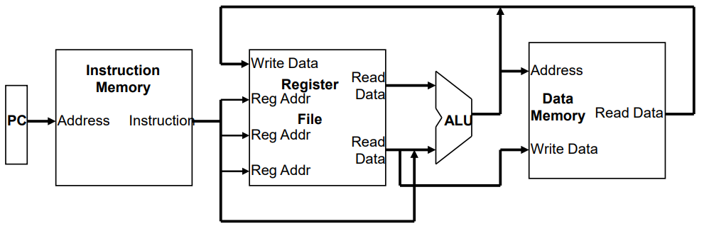

# Processor Architecture
#컴퓨터구조/Processor Architecture

---
## MIPS Processor Architecture and Pipeline Implementation
CPU performance factors
- instruction count
    - Determined by ISA and compiler
- CPI, Cycle time
    - Determined by CPU architecture

Two Mips implementations
- A simplified version
- A more realistic pipelined version

Simple subset, shows most aspects
- Arithmetic/logical: add, sub, and, or, slt
- Memory reference: lw, sw
- Control transfer: beq, j

### Logic Design Basics
Inforemation encoded in binary
- Low voltage = 0, High voltage = 1
- One wire per on bit
- Multi-bit data can be encoded on multiwire logics

Combinational element
- Operate on data
- Output is a function of input data

State(sequential) elements
- Store information
- Output is a function of input data and state

### Simple Instruction Execution Step
By using PC(program counter, instruction address)
- Access Instruction Memory(IM) and fetch instrcution

By using register numbers
- Access register file with register number(not address)

Depending on instruction class
- Use ALU to calcaulate
    - Arithmetic result
    - Memory address for load/store
    - Branch target address
- Access Data Memory(DM) for load/store
- (PC <- PC+4) or (PC <- branch target address)

### Abstract Implementation View
Two types of functional units:
- elements that operate on data values (combinational logic)
- elements that contain state (sequential logic)

Single cycle operation
- All 5 modules here execute in a Long Single cycle

- Split memory model - one memory for instructions and one memory for data(IM vs DM, Harvard Architecture)

### Clocking Methodologies
Clocking methodology defines when signals can be read and when they can be written

State element design choices
- level sensitive latch
- edge-triggered flip-flops

### The processor: Datapath & Control

All instructions (except j) use the ALU after reading the registers
- arithmetic use the ALU to do the required arithmetic operation
- memory reference use ALU to compute memory addresses
- control use the ALU to compute branch conditions and target address calculation

## Fetching Instrutions
- reading the instruction from the instruction memory
- updating the pc value to be the address of the next instruction

- PC is updated every clock cycle, so it does not need an explicit write control signal
- There is no need to use read control signal in Instruction Memory because it produces instruction every cycle

## Decoding Instructions
- First sending the fetched instructions opcode and function field bits to the control unit

- Second, reading two values from the Register File
    - Two values: Rs and Rt

## Executing R Format Operations
R format operations(add, sub, slt, and, or)
- perfrom operation (op and funct) on values in rs and rt
- store the result back into the Register File(into location rd)

- Note that register File is not written every cycle, so we need and explicit write control signal(RegWrite) for the Register File

## Executing Load and Store Operation

## Executing Branch Opreations
- compare the operands read from the Register File during decode( rs and rt values) for equality (zero ALU ouput)
- compute the branch target address by adding the updated PC to the sign extended 16-bit offset filed in the instruction
    - "base register" is the updated PC
    - offset value in the low order 16 bits of the instruction must be shifted left 2 bits to turn it into a word address and sign extended to create a 32-bit signed value

## Executing Jump Operations
- replace the lower 28 bits of the PC with the lower 2 6 bits of the fetched instruction shifted left by 2 bits(word offset)
- Concatenate with upper 4 bit in PC

